# TGF-β超家族配体与受体在人体各组织中的表达图谱

> **分析日期**: 2026-08-07  
> **数据源**: GTEx v8 bulk RNA-seq 中位TPM（主数据源）+ Human Protein Atlas 共识组织nTPM（交叉验证）  
> **基因数**: 10（2个II型受体 + 8个配体）  
> **组织分辨率**: 器官级（GTEx 54个组织亚区合并为约25个器官）

---

## 一、摘要

本报告系统分析了TGF-β超家族中10个关键成员（2个II型受体ActRIIA/ActRIIB + 8个配体Activin A/B、GDF8、GDF11、BMP2/7/9/10）在人体各组织中的mRNA表达水平。数据以GTEx v8 bulk RNA-seq各组织中位TPM为主要定量来源，以Human Protein Atlas (HPA) 共识组织nTPM作为独立交叉验证。

核心发现：

- **BMP10** 是最极端的组织特异配体，几乎仅在心脏表达（GTEx 165 TPM，HPA 727 nTPM），τ(log2)=0.99。
- **BMP9 (GDF2)** 同样高度特异，几乎仅在肝脏表达（GTEx 8.3 TPM，HPA 17.4 nTPM），τ(log2)=1.00。
- **Activin B (INHBB)** 在乳腺和脂肪组织中表达最高（GTEx 72/70 TPM），呈中度偏好分布。
- **BMP7** 在甲状腺中高表达（GTEx 46.9 TPM，HPA 43.0 nTPM），两图谱高度一致。
- **ActRIIA / ActRIIB** 作为受体呈广谱表达（τ(log2) < 0.35），在生殖系统、内分泌器官中略高。
- **GDF8 (MSTN)** 整体表达水平较低，GTEx中骨骼肌仅1.3 TPM，但HPA中舌/骨骼肌相对富集（14.3/9.4 nTPM），与其作为肌肉抑制素的经典功能一致。

---

## 二、方法

### 2.1 数据来源

| 数据源 | 版本 | 单位 | 组织数 | 用途 |
|---|---|---|---|---|
| GTEx | v8 (GTEx_Analysis_2017-06-05_v8_RNASeQCv1.1.9) | 中位TPM | 54个组织亚区 | 主定量来源 |
| Human Protein Atlas | 2023版共识组织 | nTPM | 51个组织 | 交叉验证 |

- **GTEx**: 从GTEx官方Google Storage下载v8基因中位TPM GCT文件（56200基因×54组织），按Ensembl ID匹配提取。  
  数据链接: https://gtexportal.org/home/  
  许可: NIH Genomic Data Sharing开放获取；引用dbGaP phs000424。

- **Human Protein Atlas**: 从本地datalake的proteinatlas.xml.gz（约730MB）流式解析每个基因的consensusTissue RNA表达块，提取nTPM。  
  数据链接: https://www.proteinatlas.org/  
  许可: CC BY-SA 3.0（署名+相同方式共享）。

### 2.2 基因符号映射

| 通用名 | HGNC符号 | Ensembl ID | UniProt | 类型 |
|---|---|---|---|---|
| ActRIIA | ACVR2A | ENSG00000121989 | P27037 | II型受体 |
| ActRIIB | ACVR2B | ENSG00000114739 | Q13705 | II型受体 |
| Activin A | INHBA | ENSG00000122641 | P08476 | 配体（βA亚基） |
| Activin B | INHBB | ENSG00000163083 | P09529 | 配体（βB亚基） |
| GDF8 | MSTN | ENSG00000138379 | O14793 | 配体（肌肉抑制素） |
| GDF11 | GDF11 | ENSG00000135414 | O95390 | 配体 |
| BMP2 | BMP2 | ENSG00000125845 | P12643 | 配体 |
| BMP9 | GDF2 | ENSG00000263761 | Q9UK05 | 配体（又名GDF2） |
| BMP10 | BMP10 | ENSG00000163217 | O95393 | 配体 |
| BMP7 | BMP7 | ENSG00000101144 | P18075 | 配体 |

> **注**: BMP9的官方HGNC符号为GDF2，BMP9是其常用别名。本报告中两者指同一基因。

### 2.3 组织合并规则

GTEx v8包含54个组织采样点，其中脑区有13个亚区、动脉有3个亚区等。为便于跨基因对比，将亚区合并为器官级（如所有脑亚区→脑、所有动脉亚区→动脉），合并方式为取同一器官内各亚区TPM的算术平均。合并后约25个器官。Whole Blood、培养细胞系（成纤维细胞、EBV转化淋巴细胞）、胫神经因无对应HPA共识组织而排除。

### 2.4 组织特异性评分（τ）

采用Yanai等(2005)提出的τ组织特异性评分，在log2(x+1)转换后的器官级表达谱上计算。τ取值0–1，0=完全广谱，1=完全单一组织特异。同时报告HPA原生组织特异性分类（Tissue enriched / Tissue enhanced / Group enriched / Low tissue specificity等）。

### 2.5 局限性

1. **nTPM ≠ TPM**: HPA的nTPM与GTEx的TPM归一化方式不同，不能直接比较绝对值，仅比较表达模式（排名）。
2. **bulk表达掩盖细胞类型**: 组织值是细胞混合物的平均值，某种罕见高表达细胞类型可能被稀释。
3. **表达 ≠ 蛋白 ≠ 药物暴露**: mRNA存在不等于蛋白翻译，更不等于药物能到达并作用于该靶点。
4. **GTEx v8年代**: v8数据采集于2014-2017年，为目前最新公开release。
5. **仅人类**: 不适用于小鼠等其他物种。
6. **GDF8/MSTN低表达**: MSTN在GTEx bulk中整体偏低（骨骼肌仅1.3 TPM），可能因其主要在特定肌纤维类型或发育阶段表达，bulk中位值低估了其生物学意义。

---

## 三、各基因表达详情

### 3.1 ActRIIA（ACVR2A）

**类型**: II型受体  
**Ensembl**: ENSG00000121989  
**UniProt**: [[UniProt:P27037]]  
**组织特异性**: 广谱表达（τ(log2)=0.2383；HPA: Low tissue specificity）  
**GTEx最高表达器官**: Vagina（13.49 TPM）  

**证据来源链接**:
- GTEx Portal: https://gtexportal.org/home/gene/ACVR2A  
- Human Protein Atlas: https://www.proteinatlas.org/ENSG00000121989-ACVR2A/tissue  
- UniProt: https://www.uniprot.org/uniprot/P27037  

**GTEx高表达器官（Top 5）**:

| 排名 | 器官 | GTEx TPM |
|---|---|---|
| 1 | Vagina | 13.49 |
| 2 | Urinary bladder | 13.28 |
| 3 | Salivary gland | 10.94 |
| 4 | Endometrium | 10.21 |
| 5 | Cervix, uterine | 9.90 |

**HPA交叉验证（Top 3）**:

| 器官 | HPA nTPM |
|---|---|
| Skin | 18.10 |
| Skeletal muscle | 16.40 |
| Small intestine | 7.95 |

**解读**:

ActRIIA（ACVR2A）是Activin/Nodal/BMP信号通路的II型受体，呈广谱表达（τ(log2)=0.2383），在GTEx中生殖系统器官（阴道、膀胱、唾液腺、子宫内膜、宫颈）表达略高（9–13 TPM），但整体各器官差异不大。HPA同样判定为"Low tissue specificity"，皮肤和骨骼肌nTPM较高。广谱表达与其作为多配体共享受体的生物学角色一致——ActRIIA需在多种组织中接收Activin A/B、GDF8/11等配体信号。

完整器官级表达表（ACVR2A）

| 器官 | GTEx TPM | HPA nTPM |
|---|---|---|
| Vagina | 13.49 | 6.80 |
| Urinary bladder | 13.28 | 6.70 |
| Salivary gland | 10.94 | 6.80 |
| Endometrium | 10.21 | 4.80 |
| Cervix, uterine | 9.90 | — |
| Esophagus | 9.78 | 6.80 |
| Testis | 9.54 | 5.90 |
| Breast | 9.52 | 6.50 |
| Adipose tissue | 9.12 | 6.60 |
| Thyroid gland | 8.72 | 6.30 |
| Prostate | 8.42 | 6.40 |
| Ovary | 8.26 | 4.00 |
| Colon | 7.70 | 5.90 |
| Lung | 7.65 | 4.40 |
| Small intestine | 7.42 | 7.95 |
| Pituitary gland | 6.46 | 3.50 |
| Artery | 6.38 | — |
| Stomach | 5.75 | 6.40 |
| Brain | 5.68 | 3.90 |
| Spleen | 5.21 | 3.80 |
| Kidney | 3.42 | 5.20 |
| Skeletal muscle | 3.20 | 16.40 |
| Liver | 2.77 | 6.90 |
| Pancreas | 2.69 | 4.00 |
| Heart muscle | 2.11 | 3.40 |
| Choroid plexus | — | 1.90 |
| Tongue | — | 5.90 |
| Adrenal gland | — | 3.80 |
| Bone marrow | — | 3.10 |
| Gallbladder | — | 7.20 |
| Smooth muscle | — | 6.50 |
| Lymph node | — | 2.90 |
| Thymus | — | 2.10 |
| Appendix | — | 4.40 |
| Blood vessel | — | 4.60 |
| Placenta | — | 7.30 |
| Skin | — | 18.10 |
| Cervix | — | 5.80 |
| Fallopian tube | — | 4.30 |
| Tonsil | — | 3.70 |
| Rectum | — | 6.10 |
| Parathyroid gland | — | 4.10 |
| Epididymis | — | 6.20 |
| Hippocampal formation | — | 3.20 |
| Seminal vesicle | — | 4.90 |
| Retina | — | 7.60 |

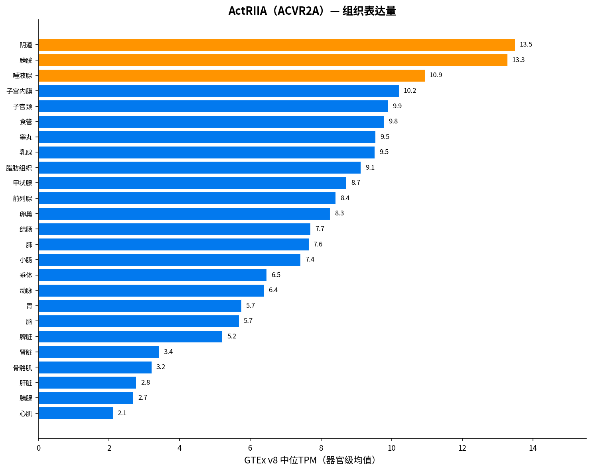

---

### 3.2 ActRIIB（ACVR2B）

**类型**: II型受体  
**Ensembl**: ENSG00000114739  
**UniProt**: [[UniProt:Q13705]]  
**组织特异性**: 中度偏好（τ(log2)=0.3495；HPA: Low tissue specificity）  
**GTEx最高表达器官**: Ovary（6.5 TPM）  

**证据来源链接**:
- GTEx Portal: https://gtexportal.org/home/gene/ACVR2B  
- Human Protein Atlas: https://www.proteinatlas.org/ENSG00000114739-ACVR2B/tissue  
- UniProt: https://www.uniprot.org/uniprot/Q13705  

**GTEx高表达器官（Top 5）**:

| 排名 | 器官 | GTEx TPM |
|---|---|---|
| 1 | Ovary | 6.50 |
| 2 | Testis | 5.95 |
| 3 | Endometrium | 5.21 |
| 4 | Pituitary gland | 4.55 |
| 5 | Cervix, uterine | 4.55 |

**HPA交叉验证（Top 3）**:

| 器官 | HPA nTPM |
|---|---|
| Retina | 6.00 |
| Skeletal muscle | 5.60 |
| Thymus | 3.80 |

**解读**:

ActRIIB（ACVR2B）同为II型受体，表达模式与ActRIIA类似呈广谱（τ(log2)=0.3495），但整体表达水平更低（最高仅6.5 TPM，卵巢）。GTEx中生殖/内分泌器官（卵巢、睾丸、子宫内膜、垂体）略高。HPA中视网膜和骨骼肌相对富集。作为GDF8（肌肉抑制素）和GDF11的核心受体，ActRIIB的广谱低水平表达为这些配体在多种组织中发挥作用提供了受体基础。

完整器官级表达表（ACVR2B）

| 器官 | GTEx TPM | HPA nTPM |
|---|---|---|
| Ovary | 6.50 | 2.50 |
| Testis | 5.95 | 2.40 |
| Endometrium | 5.21 | 1.70 |
| Pituitary gland | 4.55 | 1.90 |
| Cervix, uterine | 4.55 | — |
| Brain | 4.45 | 2.24 |
| Thyroid gland | 3.53 | 1.50 |
| Urinary bladder | 3.23 | 1.40 |
| Vagina | 3.11 | 1.30 |
| Prostate | 2.88 | 1.20 |
| Lung | 2.82 | 1.20 |
| Colon | 2.61 | 1.40 |
| Breast | 2.48 | 1.60 |
| Salivary gland | 2.30 | 1.60 |
| Kidney | 2.30 | 1.70 |
| Stomach | 2.27 | 1.40 |
| Esophagus | 2.15 | 0.70 |
| Small intestine | 2.11 | 0.95 |
| Adipose tissue | 2.08 | 1.00 |
| Skeletal muscle | 2.01 | 5.60 |
| Artery | 1.91 | — |
| Spleen | 1.88 | 1.00 |
| Pancreas | 1.87 | 2.40 |
| Liver | 1.73 | 2.10 |
| Heart muscle | 1.03 | 1.30 |
| Choroid plexus | — | 0.70 |
| Tongue | — | 2.60 |
| Adrenal gland | — | 2.70 |
| Bone marrow | — | 0.20 |
| Thymus | — | 3.80 |
| Smooth muscle | — | 0.80 |
| Lymph node | — | 0.70 |
| Gallbladder | — | 0.60 |
| Appendix | — | 0.60 |
| Blood vessel | — | 0.90 |
| Placenta | — | 2.40 |
| Skin | — | 0.70 |
| Cervix | — | 1.80 |
| Fallopian tube | — | 1.70 |
| Tonsil | — | 0.60 |
| Rectum | — | 1.10 |
| Parathyroid gland | — | 3.10 |
| Epididymis | — | 1.60 |
| Hippocampal formation | — | 1.60 |
| Seminal vesicle | — | 1.20 |
| Retina | — | 6.00 |

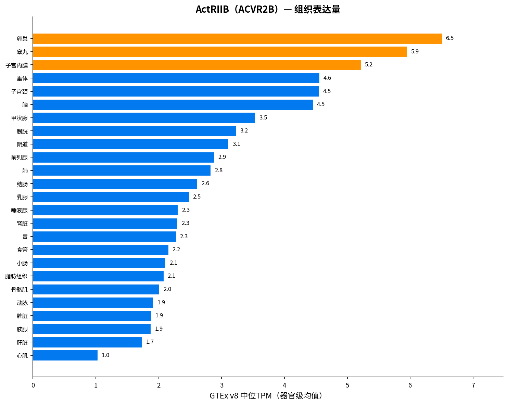

---

### 3.3 Activin A（INHBA）

**类型**: 配体（βA亚基）  
**Ensembl**: ENSG00000122641  
**UniProt**: [[UniProt:P08476]]  
**组织特异性**: 组织偏好型（τ(log2)=0.7276；HPA: Tissue enhanced）  
**GTEx最高表达器官**: Artery（19.43 TPM）  

**证据来源链接**:
- GTEx Portal: https://gtexportal.org/home/gene/INHBA  
- Human Protein Atlas: https://www.proteinatlas.org/ENSG00000122641-INHBA/tissue  
- UniProt: https://www.uniprot.org/uniprot/P08476  

**GTEx高表达器官（Top 5）**:

| 排名 | 器官 | GTEx TPM |
|---|---|---|
| 1 | Artery | 19.43 |
| 2 | Lung | 8.32 |
| 3 | Esophagus | 5.14 |
| 4 | Endometrium | 4.44 |
| 5 | Ovary | 3.34 |

**HPA交叉验证（Top 3）**:

| 器官 | HPA nTPM |
|---|---|
| Gallbladder | 20.20 |
| Blood vessel | 18.60 |
| Endometrium | 16.20 |

**解读**:

Activin A（INHBA编码βA亚基）呈组织偏好型表达（τ(log2)=0.7276），GTEx中动脉最高（19.4 TPM），其次为肺和食管。HPA中胆囊、血管、子宫内膜nTPM较高（16–20 nTPM），与GTEx的血管高表达一致。Activin A在血管生物学和炎症反应中具有重要角色，动脉中的高表达与其在血管重塑/动脉粥样硬化中的作用相符。HPA判定为"Tissue enhanced"。

完整器官级表达表（INHBA）

| 器官 | GTEx TPM | HPA nTPM |
|---|---|---|
| Artery | 19.43 | — |
| Lung | 8.32 | 10.30 |
| Esophagus | 5.14 | 2.00 |
| Endometrium | 4.44 | 16.20 |
| Ovary | 3.34 | 4.50 |
| Salivary gland | 3.29 | 5.10 |
| Liver | 2.18 | 8.90 |
| Prostate | 1.55 | 3.00 |
| Cervix, uterine | 1.47 | — |
| Kidney | 1.34 | 1.70 |
| Vagina | 1.26 | 1.00 |
| Thyroid gland | 1.25 | 1.10 |
| Heart muscle | 1.13 | 5.00 |
| Testis | 1.11 | 1.60 |
| Breast | 1.02 | 0.80 |
| Urinary bladder | 0.81 | 9.60 |
| Adipose tissue | 0.77 | 2.10 |
| Colon | 0.61 | 0.90 |
| Small intestine | 0.53 | 0.65 |
| Pituitary gland | 0.44 | 0.40 |
| Stomach | 0.31 | 0.80 |
| Brain | 0.27 | 1.24 |
| Spleen | 0.19 | 0.50 |
| Skeletal muscle | 0.17 | 0.50 |
| Pancreas | 0.12 | 0.60 |
| Choroid plexus | — | 1.00 |
| Bone marrow | — | 9.80 |
| Tongue | — | 4.30 |
| Adrenal gland | — | 1.40 |
| Gallbladder | — | 20.20 |
| Smooth muscle | — | 4.10 |
| Lymph node | — | 1.10 |
| Thymus | — | 0.20 |
| Appendix | — | 4.90 |
| Blood vessel | — | 18.60 |
| Placenta | — | 10.30 |
| Skin | — | 1.90 |
| Cervix | — | 1.40 |
| Fallopian tube | — | 1.30 |
| Tonsil | — | 0.40 |
| Rectum | — | 0.60 |
| Parathyroid gland | — | 0.50 |
| Epididymis | — | 3.50 |
| Hippocampal formation | — | 0.70 |
| Seminal vesicle | — | 4.70 |
| Retina | — | 2.10 |

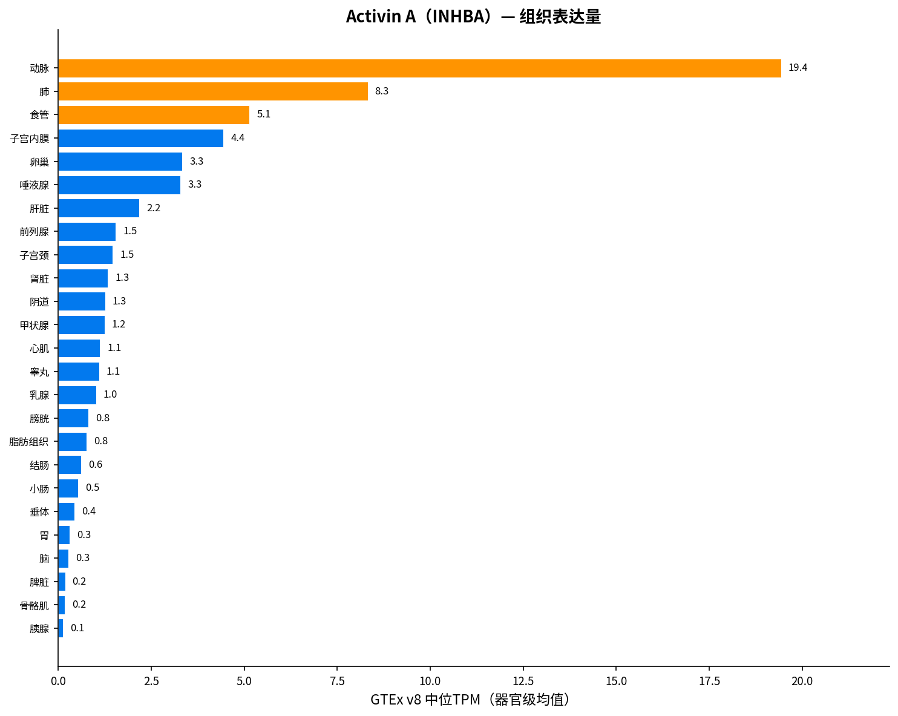

---

### 3.4 Activin B（INHBB）

**类型**: 配体（βB亚基）  
**Ensembl**: ENSG00000163083  
**UniProt**: [[UniProt:P09529]]  
**组织特异性**: 中度偏好（τ(log2)=0.4951；HPA: Tissue enhanced）  
**GTEx最高表达器官**: Breast（72.49 TPM）  

**证据来源链接**:
- GTEx Portal: https://gtexportal.org/home/gene/INHBB  
- Human Protein Atlas: https://www.proteinatlas.org/ENSG00000163083-INHBB/tissue  
- UniProt: https://www.uniprot.org/uniprot/P09529  

**GTEx高表达器官（Top 5）**:

| 排名 | 器官 | GTEx TPM |
|---|---|---|
| 1 | Breast | 72.49 |
| 2 | Adipose tissue | 70.25 |
| 3 | Testis | 42.66 |
| 4 | Thyroid gland | 38.61 |
| 5 | Salivary gland | 26.52 |

**HPA交叉验证（Top 3）**:

| 器官 | HPA nTPM |
|---|---|
| Adipose tissue | 49.60 |
| Breast | 42.20 |
| Thyroid gland | 19.90 |

**解读**:

Activin B（INHBB编码βB亚基）在GTEx中乳腺（72.5 TPM）和脂肪组织（70.3 TPM）表达远高于其他器官，其次为睾丸和甲状腺。HPA中脂肪组织和乳腺同样为前两位（49.6/42.2 nTPM），两图谱高度一致。τ(log2)=0.4951提示中度偏好。Activin B在脂肪代谢和乳腺生理中的角色值得关注。

完整器官级表达表（INHBB）

| 器官 | GTEx TPM | HPA nTPM |
|---|---|---|
| Breast | 72.49 | 42.20 |
| Adipose tissue | 70.25 | 49.60 |
| Testis | 42.66 | 16.20 |
| Thyroid gland | 38.61 | 19.90 |
| Salivary gland | 26.52 | 15.80 |
| Cervix, uterine | 19.72 | — |
| Pituitary gland | 15.24 | 7.70 |
| Prostate | 14.13 | 7.70 |
| Urinary bladder | 11.74 | 6.20 |
| Endometrium | 11.68 | 5.80 |
| Artery | 10.88 | — |
| Vagina | 9.86 | 6.10 |
| Lung | 7.37 | 4.00 |
| Liver | 5.80 | 18.90 |
| Skeletal muscle | 5.73 | 9.90 |
| Esophagus | 4.49 | 2.40 |
| Stomach | 3.76 | 3.70 |
| Brain | 3.28 | 3.74 |
| Small intestine | 2.98 | 1.70 |
| Colon | 2.89 | 3.60 |
| Ovary | 2.73 | 2.20 |
| Heart muscle | 2.33 | 5.90 |
| Kidney | 1.91 | 3.50 |
| Pancreas | 1.81 | 4.00 |
| Spleen | 0.70 | 0.50 |
| Choroid plexus | — | 2.40 |
| Tongue | — | 2.30 |
| Adrenal gland | — | 3.70 |
| Bone marrow | — | 0.20 |
| Gallbladder | — | 2.40 |
| Smooth muscle | — | 2.00 |
| Lymph node | — | 1.10 |
| Thymus | — | 0.40 |
| Appendix | — | 0.90 |
| Blood vessel | — | 9.00 |
| Placenta | — | 1.20 |
| Skin | — | 16.20 |
| Cervix | — | 6.40 |
| Fallopian tube | — | 5.50 |
| Tonsil | — | 0.60 |
| Rectum | — | 0.30 |
| Parathyroid gland | — | 5.90 |
| Epididymis | — | 2.40 |
| Hippocampal formation | — | 3.40 |
| Seminal vesicle | — | 0.80 |
| Retina | — | 1.00 |

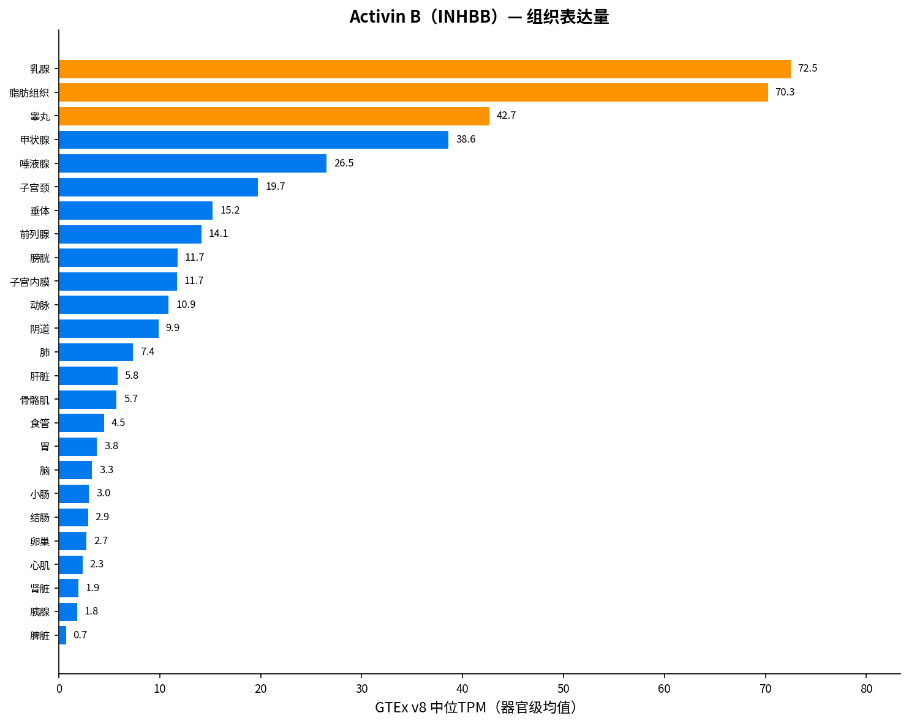

---

### 3.5 GDF8（MSTN）

**类型**: 配体（肌肉抑制素）  
**Ensembl**: ENSG00000138379  
**UniProt**: [[UniProt:O14793]]  
**组织特异性**: 组织偏好型（τ(log2)=0.6633；HPA: Group enriched）  
**GTEx最高表达器官**: Cervix, uterine（3.17 TPM）  

**证据来源链接**:
- GTEx Portal: https://gtexportal.org/home/gene/MSTN  
- Human Protein Atlas: https://www.proteinatlas.org/ENSG00000138379-MSTN/tissue  
- UniProt: https://www.uniprot.org/uniprot/O14793  

**GTEx高表达器官（Top 5）**:

| 排名 | 器官 | GTEx TPM |
|---|---|---|
| 1 | Cervix, uterine | 3.17 |
| 2 | Pituitary gland | 1.32 |
| 3 | Skeletal muscle | 1.29 |
| 4 | Endometrium | 1.05 |
| 5 | Artery | 0.96 |

**HPA交叉验证（Top 3）**:

| 器官 | HPA nTPM |
|---|---|
| Tongue | 14.30 |
| Skeletal muscle | 9.40 |
| Retina | 2.90 |

**解读**:

GDF8/肌肉抑制素（MSTN）在GTEx bulk RNA-seq中整体表达水平很低（最高仅3.2 TPM，宫颈），骨骼肌仅1.3 TPM。但HPA中舌（14.3 nTPM）和骨骼肌（9.4 nTPM）相对富集，HPA判定为"Group enriched"。GTEx与HPA的差异可能反映MSTN表达具有肌纤维类型特异性或发育阶段特异性，bulk中位值低估了其在肌肉中的生物学重要性。τ(log2)=0.6633提示组织偏好。作为负性肌肉生长调节因子，MSTN的肌肉富集与其经典功能一致。

完整器官级表达表（MSTN）

| 器官 | GTEx TPM | HPA nTPM |
|---|---|---|
| Cervix, uterine | 3.17 | — |
| Pituitary gland | 1.32 | 0.60 |
| Skeletal muscle | 1.29 | 9.40 |
| Endometrium | 1.05 | 0.70 |
| Artery | 0.96 | — |
| Brain | 0.93 | 0.60 |
| Thyroid gland | 0.92 | 0.30 |
| Ovary | 0.92 | 0.40 |
| Vagina | 0.92 | 0.50 |
| Testis | 0.74 | 0.20 |
| Prostate | 0.73 | 0.30 |
| Breast | 0.72 | 0.30 |
| Adipose tissue | 0.72 | 0.40 |
| Colon | 0.67 | 0.60 |
| Lung | 0.52 | 0.20 |
| Esophagus | 0.49 | 1.00 |
| Kidney | 0.47 | 0.50 |
| Salivary gland | 0.45 | 0.30 |
| Urinary bladder | 0.38 | 0.20 |
| Small intestine | 0.37 | 0.20 |
| Spleen | 0.35 | 0.20 |
| Stomach | 0.26 | 0.20 |
| Heart muscle | 0.18 | 0.20 |
| Pancreas | 0.17 | 0.20 |
| Liver | 0.11 | 0.10 |
| Choroid plexus | — | 0.00 |
| Tongue | — | 14.30 |
| Adrenal gland | — | 0.90 |
| Bone marrow | — | 0.00 |
| Gallbladder | — | 0.10 |
| Smooth muscle | — | 0.30 |
| Lymph node | — | 0.00 |
| Thymus | — | 0.00 |
| Appendix | — | 0.00 |
| Blood vessel | — | 0.70 |
| Placenta | — | 0.00 |
| Skin | — | 0.50 |
| Cervix | — | 1.10 |
| Fallopian tube | — | 0.30 |
| Tonsil | — | 0.00 |
| Rectum | — | 0.40 |
| Parathyroid gland | — | 0.00 |
| Epididymis | — | 0.40 |
| Hippocampal formation | — | 0.70 |
| Seminal vesicle | — | 0.10 |
| Retina | — | 2.90 |

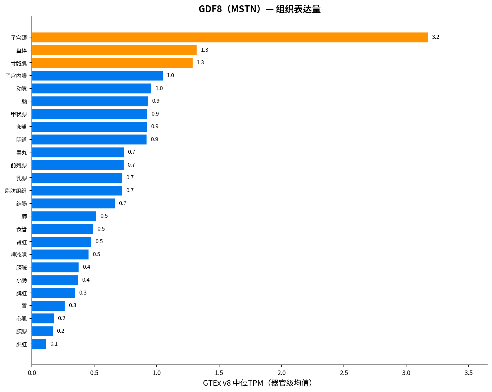

---

### 3.6 GDF11（GDF11）

**类型**: 配体  
**Ensembl**: ENSG00000135414  
**UniProt**: [[UniProt:O95390]]  
**组织特异性**: 中度偏好（τ(log2)=0.3593；HPA: Tissue enhanced）  
**GTEx最高表达器官**: Cervix, uterine（11.99 TPM）  

**证据来源链接**:
- GTEx Portal: https://gtexportal.org/home/gene/GDF11  
- Human Protein Atlas: https://www.proteinatlas.org/ENSG00000135414-GDF11/tissue  
- UniProt: https://www.uniprot.org/uniprot/O95390  

**GTEx高表达器官（Top 5）**:

| 排名 | 器官 | GTEx TPM |
|---|---|---|
| 1 | Cervix, uterine | 11.99 |
| 2 | Brain | 11.78 |
| 3 | Endometrium | 9.58 |
| 4 | Prostate | 9.27 |
| 5 | Ovary | 9.13 |

**HPA交叉验证（Top 3）**:

| 器官 | HPA nTPM |
|---|---|
| Retina | 20.00 |
| Hippocampal formation | 14.30 |
| Brain | 13.34 |

**解读**:

GDF11在GTEx中呈中度广谱表达（τ(log2)=0.3593），宫颈（12.0 TPM）、脑（11.8 TPM）、子宫内膜、前列腺、卵巢较高。HPA中视网膜（20.0 nTPM）和海马（14.3 nTPM）最高，判定为"Tissue enhanced"。GDF11在神经系统和视网膜发育中的角色已有较多研究，HPA的视网膜高表达与此一致。GTEx中脑区的高表达（合并后11.8 TPM）也支持其CNS功能。

完整器官级表达表（GDF11）

| 器官 | GTEx TPM | HPA nTPM |
|---|---|---|
| Cervix, uterine | 11.99 | — |
| Brain | 11.78 | 13.34 |
| Endometrium | 9.58 | 6.80 |
| Prostate | 9.27 | 5.60 |
| Ovary | 9.13 | 5.10 |
| Spleen | 7.36 | 5.10 |
| Urinary bladder | 6.92 | 4.70 |
| Pituitary gland | 6.14 | 4.30 |
| Thyroid gland | 5.85 | 3.30 |
| Colon | 5.42 | 4.90 |
| Vagina | 5.40 | 3.10 |
| Lung | 5.16 | 3.30 |
| Small intestine | 4.43 | 2.45 |
| Heart muscle | 3.97 | 6.80 |
| Esophagus | 3.76 | 2.20 |
| Artery | 3.72 | — |
| Adipose tissue | 3.67 | 3.30 |
| Salivary gland | 3.46 | 4.50 |
| Breast | 3.05 | 2.10 |
| Kidney | 2.46 | 3.70 |
| Testis | 2.18 | 1.00 |
| Stomach | 2.11 | 2.50 |
| Skeletal muscle | 1.04 | 1.60 |
| Pancreas | 0.82 | 2.80 |
| Liver | 0.78 | 1.20 |
| Choroid plexus | — | 10.40 |
| Tongue | — | 1.90 |
| Adrenal gland | — | 3.80 |
| Bone marrow | — | 1.70 |
| Gallbladder | — | 4.30 |
| Smooth muscle | — | 4.30 |
| Thymus | — | 4.30 |
| Lymph node | — | 2.70 |
| Appendix | — | 3.50 |
| Blood vessel | — | 3.50 |
| Placenta | — | 1.90 |
| Skin | — | 1.40 |
| Cervix | — | 6.50 |
| Fallopian tube | — | 4.90 |
| Tonsil | — | 1.70 |
| Rectum | — | 1.50 |
| Parathyroid gland | — | 2.70 |
| Epididymis | — | 1.90 |
| Hippocampal formation | — | 14.30 |
| Seminal vesicle | — | 8.90 |
| Retina | — | 20.00 |

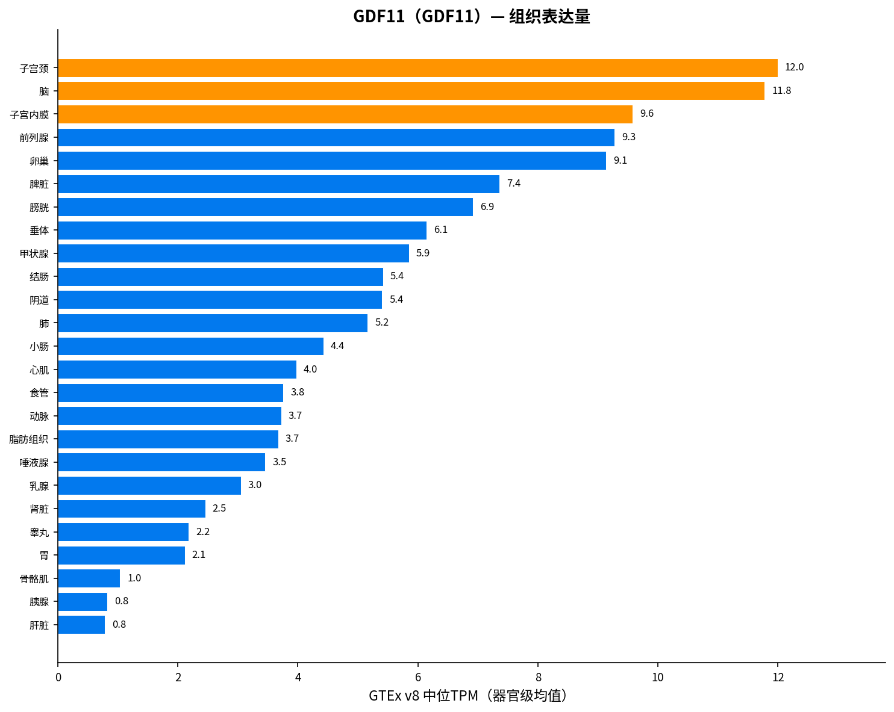

---

### 3.7 BMP2（BMP2）

**类型**: 配体  
**Ensembl**: ENSG00000125845  
**UniProt**: [[UniProt:P12643]]  
**组织特异性**: 中度偏好（τ(log2)=0.4344；HPA: Low tissue specificity）  
**GTEx最高表达器官**: Lung（24.11 TPM）  

**证据来源链接**:
- GTEx Portal: https://gtexportal.org/home/gene/BMP2  
- Human Protein Atlas: https://www.proteinatlas.org/ENSG00000125845-BMP2/tissue  
- UniProt: https://www.uniprot.org/uniprot/P12643  

**GTEx高表达器官（Top 5）**:

| 排名 | 器官 | GTEx TPM |
|---|---|---|
| 1 | Lung | 24.11 |
| 2 | Thyroid gland | 18.35 |
| 3 | Adipose tissue | 15.14 |
| 4 | Spleen | 12.12 |
| 5 | Small intestine | 10.90 |

**HPA交叉验证（Top 3）**:

| 器官 | HPA nTPM |
|---|---|
| Stomach | 19.60 |
| Lung | 17.80 |
| Thyroid gland | 17.70 |

**解读**:

BMP2呈中度广谱表达（τ(log2)=0.4344），GTEx中肺（24.1 TPM）、甲状腺（18.4 TPM）、脂肪组织、脾脏较高。HPA中胃、肺、甲状腺nTPM均约18–20，两图谱在肺和甲状腺上高度一致。HPA判定为"Low tissue specificity"。BMP2作为骨形态发生蛋白，虽以骨诱导能力著称，但其mRNA在多种组织中均有表达，提示功能不限于骨骼。

完整器官级表达表（BMP2）

| 器官 | GTEx TPM | HPA nTPM |
|---|---|---|
| Lung | 24.11 | 17.80 |
| Thyroid gland | 18.35 | 17.70 |
| Adipose tissue | 15.14 | 17.40 |
| Spleen | 12.12 | 11.70 |
| Small intestine | 10.90 | 7.70 |
| Stomach | 10.16 | 19.60 |
| Colon | 9.74 | 14.20 |
| Breast | 9.48 | 6.00 |
| Cervix, uterine | 9.15 | — |
| Vagina | 8.62 | 6.20 |
| Artery | 7.74 | — |
| Urinary bladder | 7.49 | 16.10 |
| Endometrium | 5.14 | 4.80 |
| Esophagus | 4.91 | 5.20 |
| Pituitary gland | 4.02 | 2.20 |
| Ovary | 3.51 | 2.00 |
| Prostate | 3.30 | 1.70 |
| Pancreas | 3.19 | 8.60 |
| Salivary gland | 2.80 | 2.00 |
| Kidney | 2.65 | 3.60 |
| Heart muscle | 2.30 | 3.90 |
| Liver | 1.80 | 5.50 |
| Skeletal muscle | 1.63 | 2.20 |
| Brain | 1.18 | 2.34 |
| Testis | 1.08 | 0.40 |
| Choroid plexus | — | 0.90 |
| Tongue | — | 2.50 |
| Adrenal gland | — | 1.50 |
| Bone marrow | — | 1.50 |
| Gallbladder | — | 15.10 |
| Smooth muscle | — | 2.40 |
| Lymph node | — | 1.80 |
| Thymus | — | 0.40 |
| Appendix | — | 3.80 |
| Blood vessel | — | 5.00 |
| Placenta | — | 10.80 |
| Skin | — | 10.20 |
| Cervix | — | 4.90 |
| Fallopian tube | — | 3.70 |
| Tonsil | — | 1.70 |
| Rectum | — | 12.80 |
| Parathyroid gland | — | 3.00 |
| Epididymis | — | 0.50 |
| Hippocampal formation | — | 1.50 |
| Seminal vesicle | — | 1.10 |
| Retina | — | 1.20 |

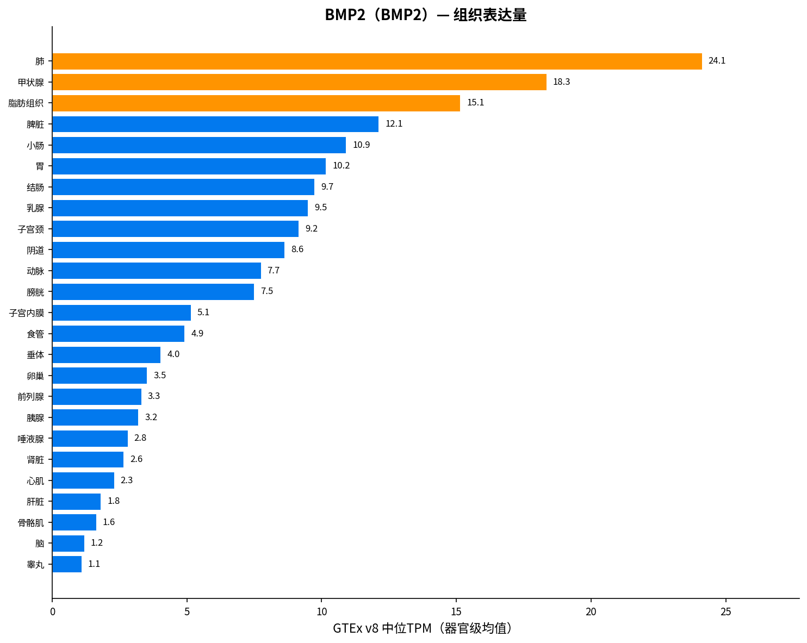

---

### 3.8 BMP9（GDF2）

**类型**: 配体（又名GDF2）  
**Ensembl**: ENSG00000263761  
**UniProt**: [[UniProt:Q9UK05]]  
**组织特异性**: 高度组织特异（τ(log2)=0.9972；HPA: Tissue enriched）  
**GTEx最高表达器官**: Liver（8.26 TPM）  

**证据来源链接**:
- GTEx Portal: https://gtexportal.org/home/gene/GDF2  
- Human Protein Atlas: https://www.proteinatlas.org/ENSG00000263761-GDF2/tissue  
- UniProt: https://www.uniprot.org/uniprot/Q9UK05  

**GTEx高表达器官（Top 5）**:

| 排名 | 器官 | GTEx TPM |
|---|---|---|
| 1 | Liver | 8.26 |
| 2 | Testis | 0.13 |
| 3 | Heart muscle | 0.03 |
| 4 | Brain | 0.00 |
| 5 | Adipose tissue | 0.00 |

**HPA交叉验证（Top 3）**:

| 器官 | HPA nTPM |
|---|---|
| Liver | 17.40 |
| Heart muscle | 0.10 |
| Placenta | 0.10 |

**解读**:

BMP9（GDF2）是本组中最组织特异的配体之一（τ(log2)=0.9972，接近1.0），GTEx中肝脏8.3 TPM，其余所有器官几乎为0。HPA中肝脏17.4 nTPM，同样远超其他组织，判定为"Tissue enriched"。两图谱完全一致地指向肝脏为BMP9的唯一主要表达部位。BMP9作为肝脏来源的内分泌配体，在血管稳态和铁代谢调节中的角色与其肝特异性表达一致。

完整器官级表达表（GDF2）

| 器官 | GTEx TPM | HPA nTPM |
|---|---|---|
| Liver | 8.26 | 17.40 |
| Testis | 0.13 | 0.00 |
| Heart muscle | 0.03 | 0.10 |
| Brain | 0.00 | 0.00 |
| Stomach | 0.00 | 0.00 |
| Choroid plexus | — | 0.00 |
| Vagina | 0.00 | 0.00 |
| Salivary gland | 0.00 | 0.00 |
| Bone marrow | — | 0.00 |
| Adipose tissue | 0.00 | 0.00 |
| Adrenal gland | — | 0.00 |
| Tongue | — | 0.00 |
| Endometrium | 0.00 | 0.00 |
| Spleen | 0.00 | 0.00 |
| Skeletal muscle | 0.00 | 0.00 |
| Gallbladder | — | 0.00 |
| Lymph node | — | 0.00 |
| Smooth muscle | — | 0.00 |
| Thymus | — | 0.00 |
| Appendix | — | 0.00 |
| Breast | 0.00 | 0.00 |
| Blood vessel | — | 0.00 |
| Lung | 0.00 | 0.00 |
| Placenta | — | 0.10 |
| Esophagus | 0.00 | 0.00 |
| Skin | — | 0.00 |
| Cervix | — | 0.00 |
| Fallopian tube | — | 0.00 |
| Tonsil | — | 0.00 |
| Prostate | 0.00 | 0.00 |
| Rectum | — | 0.00 |
| Kidney | 0.00 | 0.00 |
| Parathyroid gland | — | 0.00 |
| Epididymis | — | 0.00 |
| Urinary bladder | 0.00 | 0.00 |
| Pituitary gland | 0.00 | 0.00 |
| Artery | 0.00 | — |
| Cervix, uterine | 0.00 | — |
| Small intestine | 0.00 | 0.00 |
| Thyroid gland | 0.00 | 0.00 |
| Hippocampal formation | — | 0.00 |
| Colon | 0.00 | 0.00 |
| Ovary | 0.00 | 0.00 |
| Seminal vesicle | — | 0.00 |
| Pancreas | 0.00 | 0.00 |
| Retina | — | 0.00 |

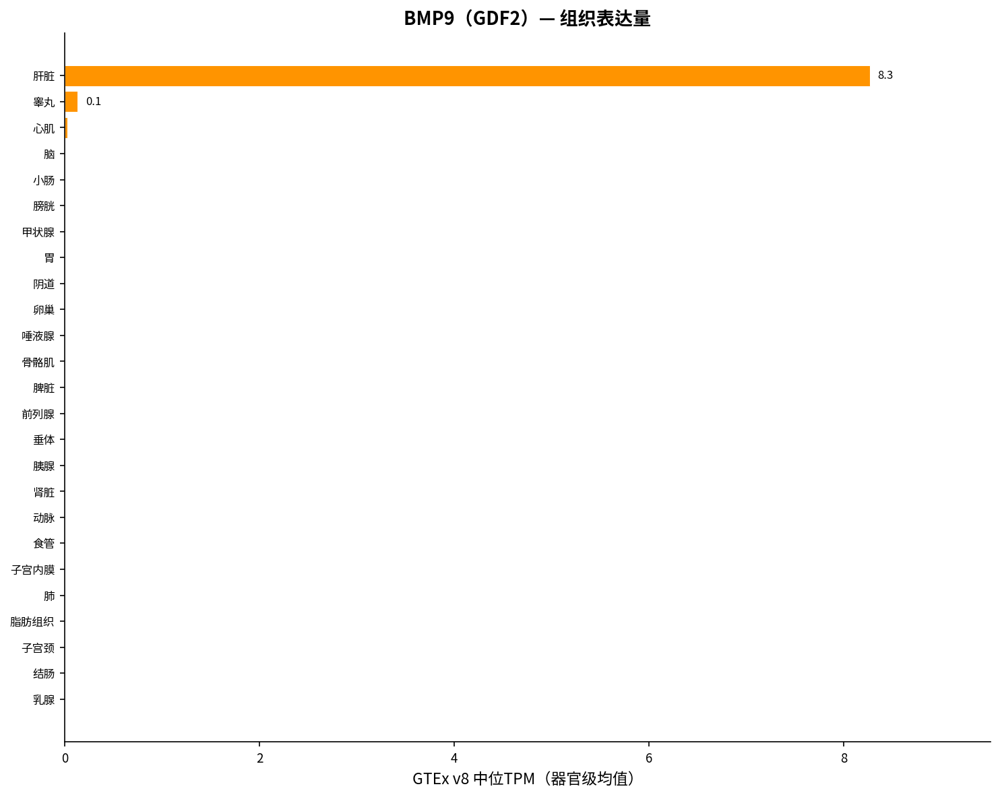

---

### 3.9 BMP10（BMP10）

**类型**: 配体  
**Ensembl**: ENSG00000163217  
**UniProt**: [[UniProt:O95393]]  
**组织特异性**: 高度组织特异（τ(log2)=0.9917；HPA: Tissue enriched）  
**GTEx最高表达器官**: Heart muscle（165.08 TPM）  

**证据来源链接**:
- GTEx Portal: https://gtexportal.org/home/gene/BMP10  
- Human Protein Atlas: https://www.proteinatlas.org/ENSG00000163217-BMP10/tissue  
- UniProt: https://www.uniprot.org/uniprot/O95393  

**GTEx高表达器官（Top 5）**:

| 排名 | 器官 | GTEx TPM |
|---|---|---|
| 1 | Heart muscle | 165.08 |
| 2 | Liver | 0.88 |
| 3 | Testis | 0.24 |
| 4 | Lung | 0.05 |
| 5 | Stomach | 0.04 |

**HPA交叉验证（Top 3）**:

| 器官 | HPA nTPM |
|---|---|
| Heart muscle | 727.20 |
| Liver | 6.10 |
| Pancreas | 0.80 |

**解读**:

BMP10是本组中表达最极端的基因（τ(log2)=0.9917），GTEx中心脏165.1 TPM，其余器官几乎为0（肝脏仅0.9 TPM）。HPA中心脏高达727.2 nTPM，两图谱完全一致。HPA判定为"Tissue enriched"。BMP10的心脏特异性表达与其在心脏发育和房室瓣膜形成中的关键角色一致，也是其作为心衰/心血管疾病靶点的表达基础。

完整器官级表达表（BMP10）

| 器官 | GTEx TPM | HPA nTPM |
|---|---|---|
| Heart muscle | 165.08 | 727.20 |
| Liver | 0.88 | 6.10 |
| Testis | 0.24 | 0.00 |
| Lung | 0.05 | 0.00 |
| Stomach | 0.04 | 0.10 |
| Vagina | 0.03 | 0.00 |
| Skeletal muscle | 0.02 | 0.10 |
| Artery | 0.01 | — |
| Adipose tissue | 0.01 | 0.00 |
| Cervix, uterine | 0.01 | — |
| Brain | 0.00 | 0.03 |
| Choroid plexus | — | 0.00 |
| Salivary gland | 0.00 | 0.30 |
| Bone marrow | — | 0.00 |
| Adrenal gland | — | 0.00 |
| Tongue | — | 0.00 |
| Endometrium | 0.00 | 0.00 |
| Spleen | 0.00 | 0.00 |
| Gallbladder | — | 0.00 |
| Lymph node | — | 0.00 |
| Smooth muscle | — | 0.00 |
| Thymus | — | 0.00 |
| Appendix | — | 0.00 |
| Breast | 0.00 | 0.30 |
| Blood vessel | — | 0.10 |
| Placenta | — | 0.10 |
| Esophagus | 0.00 | 0.00 |
| Skin | — | 0.10 |
| Cervix | — | 0.00 |
| Fallopian tube | — | 0.00 |
| Tonsil | — | 0.00 |
| Prostate | 0.00 | 0.00 |
| Rectum | — | 0.00 |
| Kidney | 0.00 | 0.00 |
| Parathyroid gland | — | 0.00 |
| Epididymis | — | 0.00 |
| Urinary bladder | 0.00 | 0.00 |
| Pituitary gland | 0.00 | 0.00 |
| Small intestine | 0.00 | 0.00 |
| Thyroid gland | 0.00 | 0.10 |
| Hippocampal formation | — | 0.00 |
| Colon | 0.00 | 0.00 |
| Ovary | 0.00 | 0.00 |
| Seminal vesicle | — | 0.00 |
| Pancreas | 0.00 | 0.80 |
| Retina | — | 0.00 |

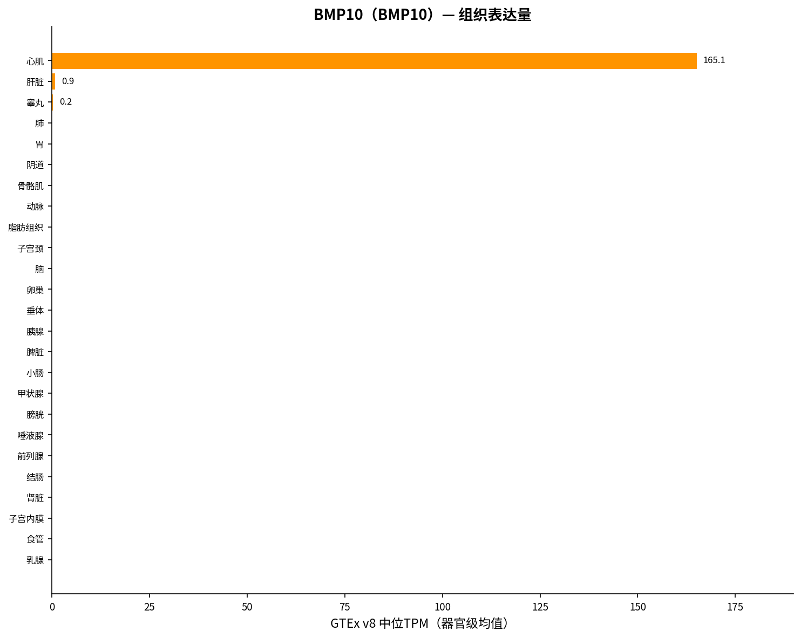

---

### 3.10 BMP7（BMP7）

**类型**: 配体  
**Ensembl**: ENSG00000101144  
**UniProt**: [[UniProt:P18075]]  
**组织特异性**: 组织偏好型（τ(log2)=0.7094；HPA: Tissue enhanced）  
**GTEx最高表达器官**: Thyroid gland（46.87 TPM）  

**证据来源链接**:
- GTEx Portal: https://gtexportal.org/home/gene/BMP7  
- Human Protein Atlas: https://www.proteinatlas.org/ENSG00000101144-BMP7/tissue  
- UniProt: https://www.uniprot.org/uniprot/P18075  

**GTEx高表达器官（Top 5）**:

| 排名 | 器官 | GTEx TPM |
|---|---|---|
| 1 | Thyroid gland | 46.87 |
| 2 | Vagina | 16.04 |
| 3 | Brain | 14.79 |
| 4 | Esophagus | 8.93 |
| 5 | Prostate | 7.82 |

**HPA交叉验证（Top 3）**:

| 器官 | HPA nTPM |
|---|---|
| Thyroid gland | 43.00 |
| Choroid plexus | 34.20 |
| Placenta | 24.20 |

**解读**:

BMP7呈组织偏好型表达（τ(log2)=0.7094），GTEx中甲状腺（46.9 TPM）远高于其他器官，其次为阴道、脑、食管。HPA中甲状腺同样最高（43.0 nTPM），两图谱高度一致，HPA判定为"Tissue enhanced"。BMP7在甲状腺中的高表达值得关注，其经典功能在肾脏发育和骨形成中，但甲状腺高表达提示可能存在尚未充分表征的内分泌角色。

完整器官级表达表（BMP7）

| 器官 | GTEx TPM | HPA nTPM |
|---|---|---|
| Thyroid gland | 46.87 | 43.00 |
| Vagina | 16.04 | 12.20 |
| Brain | 14.79 | 20.59 |
| Esophagus | 8.93 | 22.30 |
| Prostate | 7.82 | 5.60 |
| Cervix, uterine | 6.68 | — |
| Heart muscle | 5.82 | 12.90 |
| Kidney | 3.53 | 5.90 |
| Pituitary gland | 2.84 | 2.50 |
| Colon | 2.45 | 2.80 |
| Urinary bladder | 2.31 | 6.90 |
| Lung | 2.11 | 1.50 |
| Stomach | 1.93 | 3.40 |
| Salivary gland | 1.79 | 3.50 |
| Small intestine | 1.68 | 1.85 |
| Testis | 1.39 | 0.60 |
| Breast | 1.10 | 1.20 |
| Adipose tissue | 0.84 | 1.40 |
| Spleen | 0.60 | 0.60 |
| Endometrium | 0.27 | 1.10 |
| Artery | 0.21 | — |
| Ovary | 0.19 | 0.20 |
| Pancreas | 0.09 | 0.50 |
| Skeletal muscle | 0.05 | 0.30 |
| Liver | 0.02 | 0.00 |
| Choroid plexus | — | 34.20 |
| Bone marrow | — | 0.00 |
| Adrenal gland | — | 6.10 |
| Tongue | — | 0.00 |
| Thymus | — | 3.50 |
| Lymph node | — | 0.90 |
| Gallbladder | — | 0.40 |
| Smooth muscle | — | 0.30 |
| Appendix | — | 1.80 |
| Blood vessel | — | 0.70 |
| Placenta | — | 24.20 |
| Skin | — | 21.30 |
| Cervix | — | 9.60 |
| Fallopian tube | — | 8.90 |
| Tonsil | — | 1.90 |
| Rectum | — | 1.60 |
| Parathyroid gland | — | 0.00 |
| Epididymis | — | 16.30 |
| Hippocampal formation | — | 22.50 |
| Seminal vesicle | — | 8.70 |
| Retina | — | 4.90 |

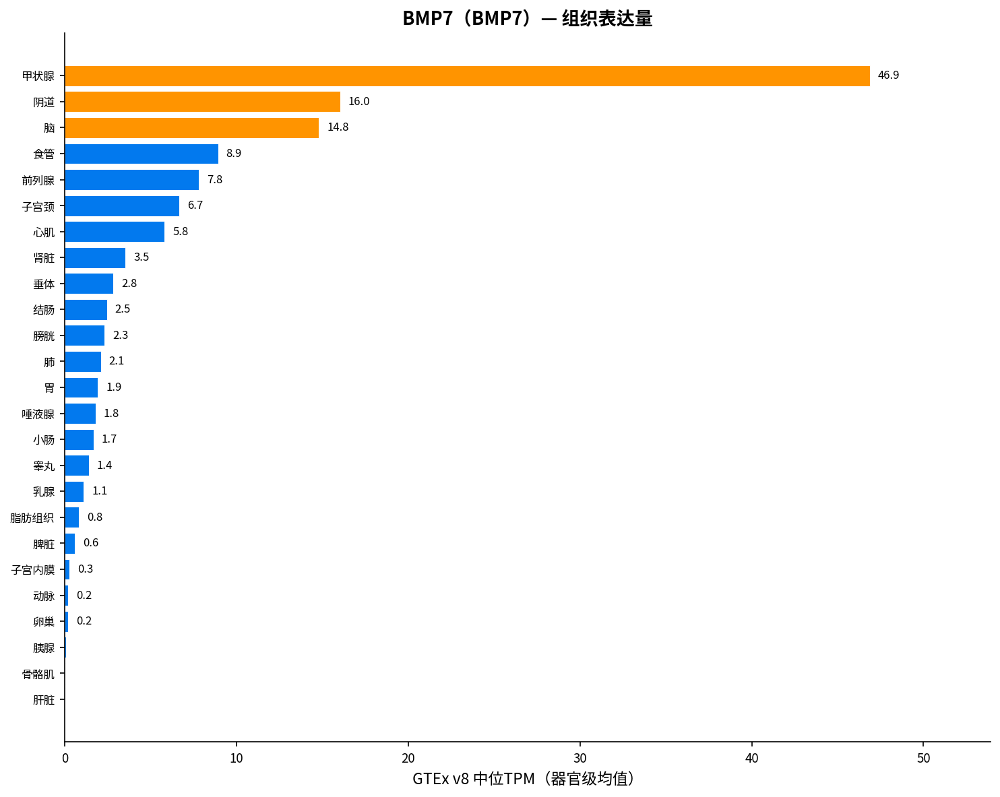

---

## 四、跨基因对比分析

### 4.1 表达广度对比

| 基因 | 通用名 | τ(log2) | τ(linear) | HPA分类 | 最高表达器官 | 最高TPM |
|---|---|---|---|---|---|---|
| ACVR2A | ActRIIA | 0.2383 | 0.4621 | Low tissue specificity | Vagina | 13.49 |
| ACVR2B | ActRIIB | 0.3495 | 0.5576 | Low tissue specificity | Ovary | 6.5 |
| INHBA | Activin A | 0.7276 | 0.912 | Tissue enhanced | Artery | 19.43 |
| INHBB | Activin B | 0.4951 | 0.8177 | Tissue enhanced | Breast | 72.49 |
| MSTN | GDF8 | 0.6633 | 0.7946 | Group enriched | Cervix, uterine | 3.17 |
| GDF11 | GDF11 | 0.3593 | 0.5919 | Tissue enhanced | Cervix, uterine | 11.99 |
| BMP2 | BMP2 | 0.4344 | 0.7297 | Low tissue specificity | Lung | 24.11 |
| GDF2 | BMP9 | 0.9972 | 0.9992 | Tissue enriched | Liver | 8.26 |
| BMP10 | BMP10 | 0.9917 | 0.9997 | Tissue enriched | Heart muscle | 165.08 |
| BMP7 | BMP7 | 0.7094 | 0.9258 | Tissue enhanced | Thyroid gland | 46.87 |

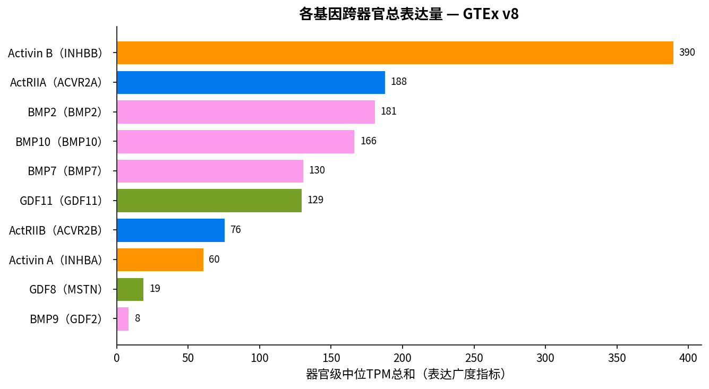

### 4.2 跨基因热图

下图展示10个基因在所有器官的log2(TPM+1)表达量，便于一眼对比各基因的组织分布模式。

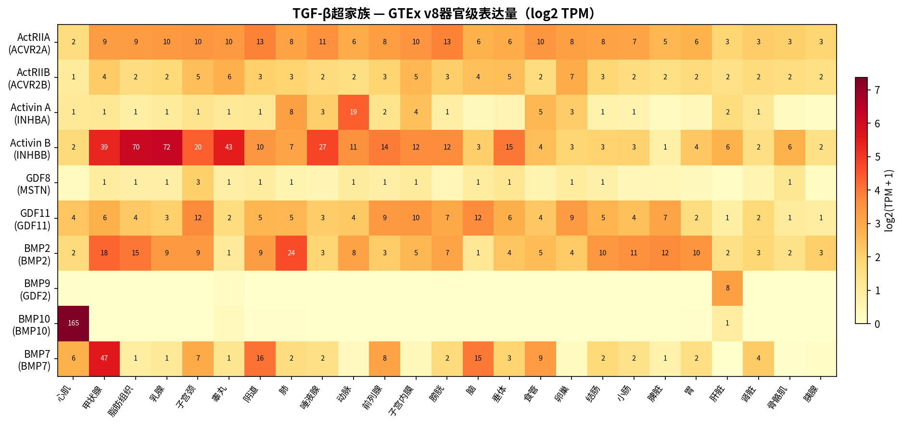

### 4.3 关键对比发现

**1. 受体 vs 配体的表达策略**  
两个II型受体（ActRIIA、ActRIIB）均呈广谱低水平表达（τ(log2) < 0.35），而配体的表达策略分化明显——从广谱（BMP2、GDF11）到极端特异（BMP10、BMP9）。这符合信号系统的逻辑：共享受体需在多种组织中待命以接收不同配体信号，而配体通过组织特异性表达来决定信号在何处被激活。

**2. 高度组织特异配体**  
BMP10（心脏，GTEx 165 TPM / HPA 727 nTPM）和BMP9/GDF2（肝脏，GTEx 8.3 / HPA 17.4）是两个最极端的特异配体，τ(log2)均接近1.0，两图谱完全一致。它们更像是器官特异性内分泌因子而非旁分泌配体。

**3. 中度偏好配体**  
Activin B（乳腺/脂肪）、BMP7（甲状腺）、Activin A（动脉）、GDF8（肌肉）呈中度组织偏好，在1–2个器官高表达但其他器官也有可检测水平。GDF8虽GTEx bulk值偏低，但HPA中舌/骨骼肌富集与其肌肉抑制素功能一致。

**4. 广谱配体**  
BMP2和GDF11表达较广谱，BMP2在肺/甲状腺/脂肪/脾等多个器官有中等表达，GDF11在宫颈/脑/生殖器官分布。HPA对BMP2判定为"Low tissue specificity"。

**5. 两图谱一致性**  
多数基因的GTEx和HPA最高表达器官一致或高度相关：BMP10（心脏）、BMP9（肝脏）、BMP7（甲状腺）、Activin B（脂肪/乳腺）在两图谱中top器官完全吻合。ActRIIA/ActRIIB因广谱表达，两图谱top器官略有差异但均判定为低特异性。GDF8是两图谱差异最大的基因（GTEx宫颈 vs HPA舌/骨骼肌），反映其表达的细胞类型特异性和bulk平均的局限。

**6. 联合用药/靶点选择启示**  
若以ActRIIA/ActRIIB为靶点（如bimagrumab等抗ActRIIB抗体用于肌肉萎缩），需注意其广谱表达意味着on-target效应可能涉及多种组织。而BMP10/BMP9的高度组织特异表达使其更适合作为器官特异性干预的靶点或生物标志物。

---

## 五、数据源与引用

### 数据源

1. **GTEx Portal** — GTEx Analysis v8, RNA-seq median TPM.  
   URL: https://gtexportal.org/home/  
   文件: GTEx_Analysis_2017-06-05_v8_RNASeQCv1.1.9_gene_median_tpm.gct.gz  
   dbGaP: phs000424  
   引用: GTEx Consortium. Science 348, 648-660 (2015); Science 357, 635 (2017).

2. **Human Protein Atlas** — Consensus tissue RNA expression (nTPM).  
   URL: https://www.proteinatlas.org/  
   引用: Uhlén M et al. Science 357, eaan2507 (2017); Karlsson M et al. Science 374, eabe5989 (2021).  
   许可: CC BY-SA 3.0（署名+相同方式共享）。

3. **UniProt** — 蛋白注释与ID映射。  
   URL: https://www.uniprot.org/  
   许可: CC BY 4.0。

4. **Ensembl** — 基因ID解析。  
   URL: https://www.ensembl.org/

### 组织特异性方法

τ评分: Yanai I, Benjamin H, Shmoish M et al. Genome Biology 6, R109 (2005).

### 数据归属声明

> 组织表达数据来自GTEx（GTEx Portal, 访问于2026-08-07; dbGaP phs000424）和Human Protein Atlas（proteinatlas.org）。HPA数据在CC BY-SA 3.0许可下使用（署名+相同方式共享）；GTEx开放获取摘要数据在NIH Genomic Data Sharing政策下使用。

---

## 附：输出文件清单

| 文件 | 说明 |
|---|---|
| report_tgfb_superfamily_tissue_expression.md | 本报告 |
| tgfb_superfamily_tissue_expression.csv | 基因×器官×数据源合并表 |
| figures/*.png | 10张单基因柱状图 + 热图 + 总表达量对比图 |
| tables/*_gtex_organ.csv | 各基因GTEx器官级TPM表 |
| tables/*_hpa_organ.csv | 各基因HPA器官级nTPM表 |
| tables/gene_metadata_summary.csv | 基因元数据汇总 |