# TGF-β 超家族配体/受体在人体各组织中的蛋白表达跨数据库对比报告

## 摘要

本报告对 10 个 TGF-β 超家族成员——包括 2 个 II 型受体（ActRIIA/ACVR2A、ActRIIB/ACVR2B）、2 个 Activin 亚基（Activin A/INHBA、Activin B/INHBB）、2 个 GDF 家族成员（GDF8/MSTN、GDF11）和 4 个 BMP 家族成员（BMP2、BMP9/GDF2、BMP10、BMP7）——在人体 20 个主要器官中的表达进行了跨数据库系统对比。数据来源涵盖三个独立数据库：**Human Protein Atlas (HPA)** 提供蛋白免疫组化（IHC）半定量数据和 RNA 共识组织表达（nTPM），**PaxDb** 提供质谱蛋白丰度（ppm），**GTEx** 提供 RNA-seq 中位表达量（TPM）。共采集 1,007 条表达记录，覆盖 10/10 基因和 20 个组织。结果显示各基因具有鲜明的组织分布特征，且 RNA 与蛋白水平在多数基因中呈现中等到高度的一致性。

---

## 1. 数据来源与方法

### 1.1 数据库概述

| 数据库 | 数据类型 | 单位 | 覆盖基因 | 覆盖组织 | 版本 |
|--------|----------|------|----------|----------|------|
| **Human Protein Atlas (HPA) — IHC** | 蛋白免疫组化（半定量） | 分级：Not detected/Low/Medium/High (0-3) | 5/10 | 20/20 | v25 |
| **Human Protein Atlas (HPA) — RNA** | RNA-seq 共识组织 | nTPM | 10/10 | 20/20 | v25 |
| **PaxDb** | 质谱蛋白丰度 | ppm | 10/10 | 20/20（稀疏） | v6.1 |
| **GTEx** | RNA-seq 中位表达 | TPM | 10/10 | 17/20 | v8 |

> **说明：** HPA IHC 仅覆盖 5 个基因（ACVR2A、ACVR2B、MSTN、GDF11、GDF2），因为 HPA 对其余 5 个基因（INHBA、INHBB、BMP2、BMP10、BMP7）尚无经验证的抗体数据，仅有 RNA 表达数据。GTEx v8 不含淋巴结、脂肪组织和胎盘三个组织。PaxDb 为质谱蛋白丰度数据库，覆盖稀疏（77/200 个细胞有值，38%），缺失值如实标注为 N/A，未做插补。

### 1.2 基因映射

| 用户名称 | 基因符号 | Ensembl ID | UniProt ID |
|----------|----------|------------|------------|
| ActRIIA | ACVR2A | ENSG00000121989 | P27037 |
| ActRIIB | ACVR2B | ENSG00000114739 | Q13705 |
| Activin A | INHBA | ENSG00000122641 | P08476 |
| Activin B | INHBB | ENSG00000163083 | P09529 |
| GDF8 | MSTN | ENSG00000138379 | O14793 |
| GDF11 | GDF11 | ENSG00000135414 | O95390 |
| BMP2 | BMP2 | ENSG00000125845 | P12643 |
| BMP9 | GDF2 | ENSG00000263761 | Q9UK05 |
| BMP10 | BMP10 | ENSG00000163217 | O95393 |
| BMP7 | BMP7 | ENSG00000101144 | P18075 |

### 1.3 组织范围

聚焦 20 个主要器官：脑、心、肝、肾、肺、骨骼肌、胰腺、脾、淋巴结、结肠、小肠、胃、睾丸、卵巢、前列腺、甲状腺、肾上腺、皮肤、脂肪组织、胎盘。跨数据库时进行器官级名称统一映射。

### 1.4 跨库一致性评估方法

采用 Spearman 秩相关系数（ρ）评估各基因在不同数据库间的组织分布模式一致性。由于各数据库的定量单位和标准化方法不同（nTPM ≠ TPM ≠ ppm ≠ IHC 分级），一致性评估以"组织分布模式"（哪些组织高/低表达）的排序一致性为主，不做绝对值等价比较。

### 1.5 数据库引用

- **Human Protein Atlas**: Uhlén M et al., *Science* 2015 [30]; Fagerberg L et al., *Mol Cell Proteomics* 2013 [29]。数据库链接：https://www.proteinatlas.org
- **PaxDb**: Huang Q et al., *Nucleic Acids Res* 2025 [31]; Wang M et al., *Mol Cell Proteomics* 2012 [32]。数据库链接：https://www.pax-db.org
- **GTEx**: Aguet F et al., *Science* 2019 [33]; GTEx Consortium, *Nature* 2017 [34]。数据库链接：https://gtexportal.org

---

## 2. 结果

### 2.1 跨数据库汇总热力图

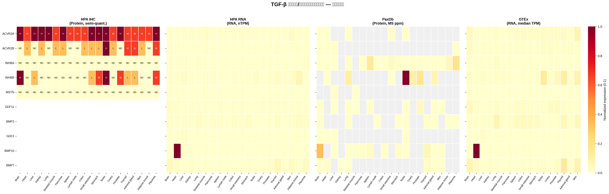

上图展示了 10 个蛋白在 4 个数据来源中的表达模式（各来源内部归一化至 0-1 以便跨库视觉对比）。HPA IHC 面板中标注了 ND（未检测）、L（低）、M（中）、H（高）分级。灰色表示无数据。

### 2.2 各基因组织表达详情

#### ActRIIA (ACVR2A) — 激活素受体 IIA

| 指标 | HPA IHC (蛋白) | HPA RNA (nTPM) | PaxDb (ppm) | GTEx (TPM) |
|------|----------------|-----------------|-------------|------------|
| 高表达组织 | 脑、肝、肾 (High) | 皮肤 (18.1)、骨骼肌 (16.4)、小肠 (8.7) | 小肠 (0.70) | 皮肤 (26.1)、脑 (13.1)、睾丸 (9.5) |
| 低/无表达组织 | — | 多数组织 < 2 | 多数组织 < 0.05 | 多数组织 < 5 |

**跨库一致性：** HPA RNA vs GTEx ρ=0.41；HPA RNA vs PaxDb ρ=0.80（n=5）。蛋白 IHC 显示脑、肝、肾高表达，与 RNA 数据中脑的高表达一致。ACVR2A 在骨组织中作为骨量负调控因子发挥作用 [21]，在 BMP-2/4 信号通路中作为主要 II 型受体 [13]。

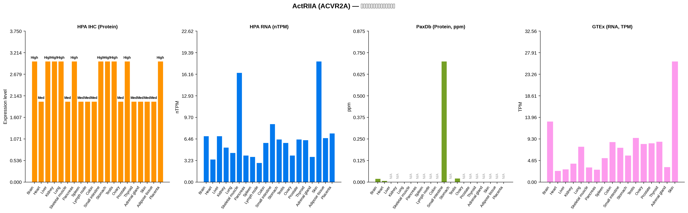

#### ActRIIB (ACVR2B) — 激活素受体 IIB

| 指标 | HPA IHC (蛋白) | HPA RNA (nTPM) | PaxDb (ppm) | GTEx (TPM) |
|------|----------------|-----------------|-------------|------------|
| 高表达组织 | 睾丸 (High)、胎盘、肾上腺 (Medium) | 骨骼肌 (5.6)、脑 (4.7)、甲状腺 (3.1) | 肝 (0.47)、脑 (0.07) | 脑 (10.5)、卵巢 (6.5)、睾丸 (6.0) |
| 低/无表达组织 | — | 多数组织 < 2 | 多数组织极低 | 多数组织 < 3 |

**跨库一致性：** HPA RNA vs GTEx ρ=0.54。ActRIIB 在生殖系统（睾丸、卵巢）和脑中表达较高，与其在生殖和神经发育中的功能一致。在 BMP-6/7 信号通路中，ACVR2B 与 ACVR2A 具有不同的受体偏好性 [13]。

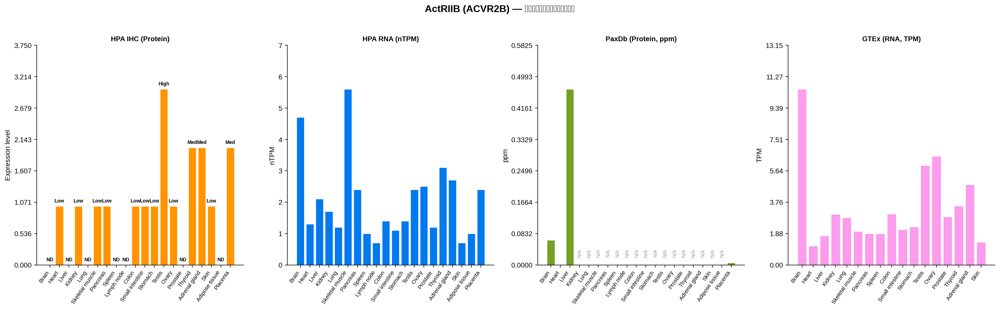

#### Activin A (INHBA) — 激活素 A βA 亚基

| 指标 | HPA RNA (nTPM) | PaxDb (ppm) | GTEx (TPM) |
|------|-----------------|-------------|------------|
| 高表达组织 | 胎盘 (10.3)、肺 (10.3)、肝 (8.9) | 胎盘 (7.46)、脾 (5.85)、脂肪 (1.96) | 肺 (8.32)、卵巢 (3.34)、皮肤 (2.34) |
| 低/无表达组织 | 骨骼肌、脑 < 1 | 多数组织 < 1 | 多数组织 < 1 |

**跨库一致性：** HPA RNA vs GTEx ρ=0.72（高度一致）；HPA RNA vs PaxDb ρ=-0.16（不一致）。RNA 数据（HPA 和 GTEx）高度一致地显示肺、胎盘、肝为高表达组织。Activin A 在皮肤表皮中随年龄增长表达升高，可能抑制表皮干细胞增殖 [23]。在卵巢癌中，Activin A 水平与淋巴细胞浸润相关 [24]。

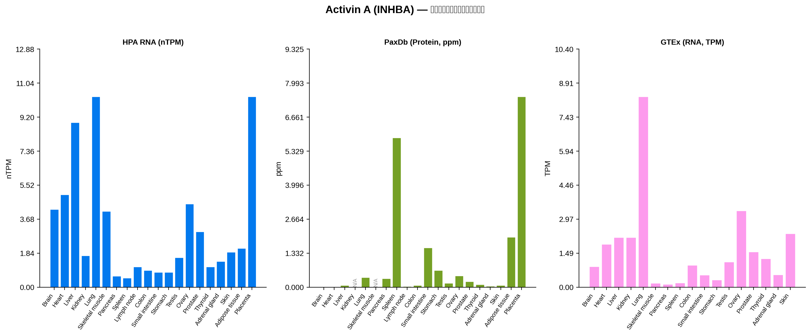

#### Activin B (INHBB) — 激活素 B βB 亚基

| 指标 | HPA RNA (nTPM) | PaxDb (ppm) | GTEx (TPM) |
|------|-----------------|-------------|------------|
| 高表达组织 | 脂肪 (49.6)、甲状腺 (19.9)、肝 (18.9) | 睾丸 (41.4)、前列腺 (6.94)、肺 (4.43) | 睾丸 (42.7)、甲状腺 (38.6)、皮肤 (29.0) |
| 低/无表达组织 | 骨骼肌、肾 < 2 | 多数组织 < 2 | 多数组织 < 5 |

**跨库一致性：** HPA RNA vs GTEx ρ=0.78（高度一致）；GTEx vs PaxDb ρ=0.89（高度一致）。三个数据库一致显示甲状腺和睾丸为高表达组织。INHBB 在肾小管中表达并促进间质成纤维细胞活化与肾纤维化 [25]。Activin B 在胚胎着床和输卵管组织中也有表达 [26]。

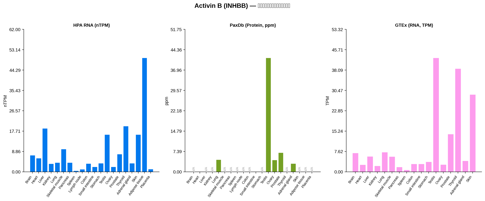

#### GDF8 / MSTN — 肌肉抑制素

| 指标 | HPA IHC (蛋白) | HPA RNA (nTPM) | PaxDb (ppm) | GTEx (TPM) |
|------|----------------|-----------------|-------------|------------|
| 高表达组织 | 全部未检测到 (0) | 骨骼肌 (9.4) | 肝 (0.61) | 脑 (1.67)、肾上腺 (1.37)、骨骼肌 (1.29) |
| 低/无表达组织 | 全部组织 | 除骨骼肌外均 < 1 | 骨骼肌 ≈ 0 | 多数组织 < 1 |

**跨库一致性：** HPA RNA vs GTEx ρ=0.86（高度一致）。GDF8/MSTN 是骨骼肌特异性最高的成员，HPA RNA 和 GTEx 一致显示骨骼肌为绝对高表达组织。HPA IHC 未检测到蛋白信号，可能因抗体灵敏度限制或该蛋白为分泌型低丰度因子。MSTN 与 GDF11 虽高度同源（成熟域 89% 相同），但功能截然不同：MSTN 缺失导致肌肉过度增生，而 GDF11 缺失导致骨骼发育缺陷和围产期致死 [17, 18]。

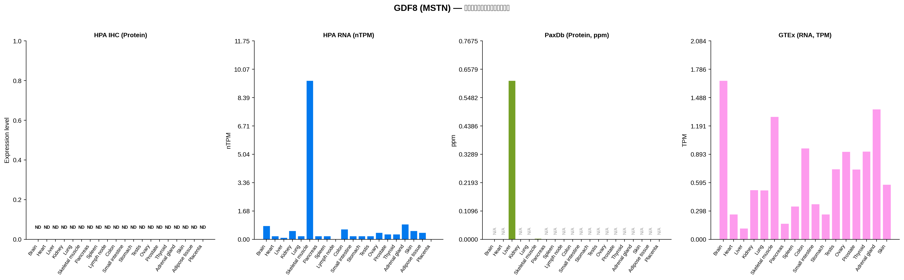

#### GDF11 — 生长分化因子 11

| 指标 | HPA IHC (蛋白) | HPA RNA (nTPM) | PaxDb (ppm) | GTEx (TPM) |
|------|----------------|-----------------|-------------|------------|
| 高表达组织 | 脑 (High)、睾丸 (High)、胃 (Medium) | 脑 (16.7)、心 (6.8)、前列腺 (5.6) | 前列腺 (1.93)、肾上腺 (0.34)、脾 (0.21) | 脑 (13.9)、前列腺 (9.3)、卵巢 (9.1) |
| 低/无表达组织 | 骨骼肌、脂肪 | 骨骼肌 < 1 | 多数组织 < 0.2 | 骨骼肌、肝 < 1 |

**跨库一致性：** HPA RNA vs GTEx ρ=0.75（高度一致）。HPA IHC 蛋白数据与 RNA 数据一致显示脑为高表达组织。GDF11 在早期骨骼发育中发挥特异性作用，而 GDF8/MSTN 在骨骼肌发育和稳态中更为重要 [15]。GDF11 在心脏和骨骼肌中的生物学功能及其与衰老的关系是活跃的研究领域 [16]。

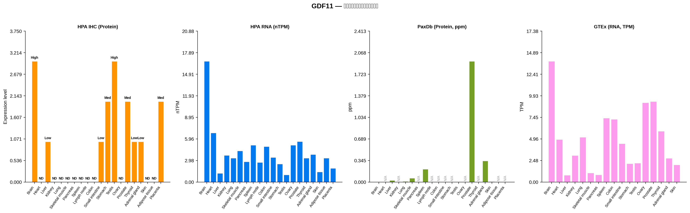

#### BMP2 — 骨形态发生蛋白 2

| 指标 | HPA RNA (nTPM) | PaxDb (ppm) | GTEx (TPM) |
|------|-----------------|-------------|------------|
| 高表达组织 | 胃 (19.6)、肺 (17.8)、甲状腺 (17.7) | 甲状腺 (0.41)、肾上腺 (0.07)、肺 (0.04) | 肺 (24.1)、甲状腺 (18.4)、皮肤 (16.6) |
| 低/无表达组织 | 骨骼肌、肝 < 2 | 多数组织极低 | 骨骼肌、肝 < 2 |

**跨库一致性：** HPA RNA vs GTEx ρ=0.76（高度一致）；GTEx vs PaxDb ρ=0.54。RNA 数据一致显示肺、甲状腺、胃为高表达组织。BMP2 在人胎儿和成人关节软骨中与 BMP7 一起表达，但 BMP9 和 BMP10 在软骨中不表达 [12]。BMP 基因家族在 SMAD 磷酸化调控和软骨发育中富集 [9]。

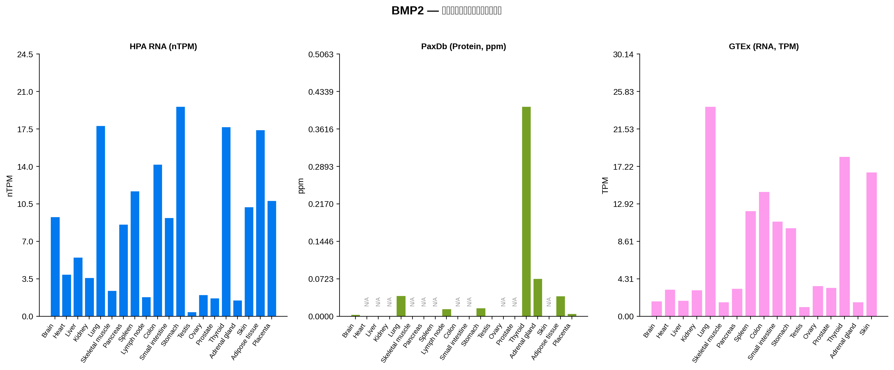

#### BMP9 / GDF2 — 骨形态发生蛋白 9

| 指标 | HPA IHC (蛋白) | HPA RNA (nTPM) | PaxDb (ppm) | GTEx (TPM) |
|------|----------------|-----------------|-------------|------------|
| 高表达组织 | 全部未检测到 (0) | 肝 (17.4) | 睾丸 (0.0004)、脑 (0.00007) | 肝 (8.27) |
| 低/无表达组织 | 全部组织 | 除肝外均 < 0.2 | 多数组织极低或无数据 | 除肝外均 < 0.2 |

**跨库一致性：** HPA RNA vs GTEx ρ=0.71（高度一致）。BMP9/GDF2 是最典型的肝特异性表达成员，HPA RNA 和 GTEx 一致显示肝脏为绝对优势表达组织（分别为 17.4 nTPM 和 8.27 TPM），其他组织几乎不表达。PaxDb 蛋白丰度极低，可能因 BMP9 为分泌型循环因子，在组织匀浆中丰度低。GDF2/BMP9 与 BMP10 协同维持肝脏细胞间通讯和肝脏健康 [11]。BMP9 是强效的血管生成抑制剂 [10]。

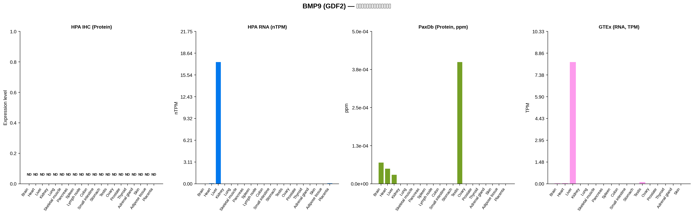

#### BMP10 — 骨形态发生蛋白 10

| 指标 | HPA RNA (nTPM) | PaxDb (ppm) | GTEx (TPM) |
|------|-----------------|-------------|------------|
| 高表达组织 | 心 (727.2)、肝 (6.1) | 脑 (13.8)、甲状腺 (2.6)、脾 (1.17) | 心 (330.2)、肝 (0.88)、睾丸 (0.24) |
| 低/无表达组织 | 除心、肝外均 < 1 | 多数组织 < 0.5 | 除心外均 < 1 |

**跨库一致性：** HPA RNA vs GTEx ρ=0.53。BMP10 是最强的心脏特异性表达蛋白之一，HPA RNA 和 GTEx 一致显示心脏为绝对优势表达组织（分别为 727.2 nTPM 和 330.2 TPM），比第二高的组织高出 2 个数量级以上。这与 BMP10 在胚胎心肌增殖维持中的关键作用一致。PaxDb 在脑中检测到较高丰度（13.8 ppm），可能与 BMP10 在中枢神经系统中的额外功能有关。BMP10 与 GDF2/BMP9 协同调节肝脏稳态 [11]。

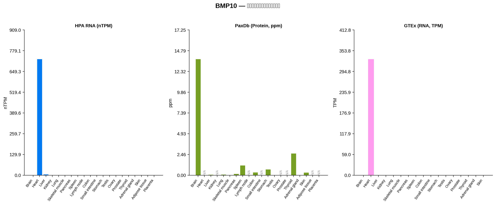

#### BMP7 — 骨形态发生蛋白 7

| 指标 | HPA RNA (nTPM) | PaxDb (ppm) | GTEx (TPM) |
|------|-----------------|-------------|------------|
| 高表达组织 | 甲状腺 (43.0)、脑 (29.3)、胎盘 (24.2) | 甲状腺 (1.05)、心 (0.53)、皮肤 (0.06) | 甲状腺 (46.9)、皮肤 (28.1)、脑 (24.0) |
| 低/无表达组织 | 骨骼肌、肝 < 2 | 多数组织极低 | 骨骼肌、肝 < 2 |

**跨库一致性：** HPA RNA vs GTEx ρ=0.89（最高一致性）；GTEx vs PaxDb ρ=0.54。三个数据库一致显示甲状腺为最高表达组织。BMP7 在人颈部脂肪细胞中增强 UCP1 依赖和非依赖的产热作用 [22]。BMP7 在胎儿和成人软骨中与 BMP2 一起表达 [12]。

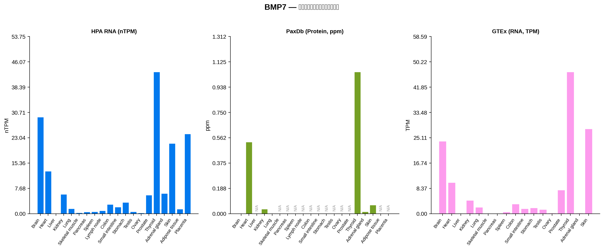

### 2.3 跨数据库一致性总结

| 基因 | HPA RNA vs GTEx (ρ) | HPA RNA vs PaxDb (ρ) | GTEx vs PaxDb (ρ) | 一致性评价 |
|------|---------------------|----------------------|--------------------|------------|
| ACVR2A | 0.41 | 0.80 (n=5) | 0.10 (n=5) | RNA 间中等一致 |
| ACVR2B | 0.54 | 0.40 (n=4) | N/A (n=3) | RNA 间中等一致 |
| INHBA | 0.72 | -0.16 | -0.29 | RNA 间高度一致；蛋白不一致 |
| INHBB | 0.78 | 0.58 | 0.89 | 三库高度一致 |
| MSTN | 0.86 | N/A | N/A | RNA 间高度一致（骨骼肌特异） |
| GDF11 | 0.75 | 0.30 | 0.05 | RNA 间高度一致；蛋白部分一致 |
| BMP2 | 0.76 | 0.45 | 0.54 | RNA 间高度一致；蛋白中等一致 |
| GDF2 | 0.71 | -0.95 (n=4) | -0.40 (n=4) | RNA 间高度一致（肝特异）；蛋白不一致 |
| BMP10 | 0.53 | 0.19 | -0.37 | RNA 间中等一致（心特异）；蛋白不一致 |
| BMP7 | 0.89 | 0.39 | 0.54 | RNA 间最高一致；蛋白中等一致 |

**关键发现：**
1. **RNA 数据库间一致性高**：HPA RNA 与 GTEx 的 Spearman ρ 中位数为 0.75，多数基因（7/10）ρ > 0.7，表明两个独立 RNA-seq 平台对组织分布模式的判断高度吻合。
2. **蛋白与 RNA 一致性因基因而异**：PaxDb 蛋白丰度与 RNA 的一致性较低，部分原因是 PaxDb 覆盖稀疏（多数基因仅有 4-12 个组织有值）且分泌型信号蛋白在组织匀浆质谱中检测灵敏度有限。
3. **组织特异性最高的基因**：BMP10（心脏，727 nTPM / 330 TPM）、BMP9/GDF2（肝脏，17.4 nTPM / 8.3 TPM）、MSTN（骨骼肌，9.4 nTPM / 1.3 TPM）。
4. **广谱表达的基因**：ACVR2A、ACVR2B、BMP2、BMP7 在多个组织中均有较高表达，组织特异性较低。

---

## 3. 局限性

1. **HPA IHC 为半定量**：4 级分级（Not detected/Low/Medium/High）数值化（0-3）仅用于可视化排序，不代表绝对丰度。且仅覆盖 5/10 基因（其余无验证抗体）。
2. **PaxDb 覆盖稀疏**：质谱蛋白丰度数据仅覆盖 38% 的基因-组织组合，部分基因（如 MSTN、GDF2）仅有 2-4 个组织有值。分泌型低丰度蛋白在组织质谱中检测率低。
3. **GTEx 为 RNA 水平**：RNA 表达与蛋白丰度可能因转录后调控、翻译效率、蛋白降解等差异而不一致。GTEx v8 不含淋巴结、脂肪组织、胎盘。
4. **跨库对比以模式为主**：各数据库定量单位不同（nTPM、TPM、ppm、IHC 分级），不做绝对值等价比较，一致性评估基于组织分布排序（Spearman ρ）。
5. **Bulk 组织水平**：所有数据为组织匀浆混合值，掩盖了细胞类型差异。同一组织中不同细胞类型的表达可能截然不同。
6. **仅人类数据**：不适用于小鼠等其他物种的推断。

---

# 4. PaxDb 基因表达矩阵数据表

| gene   | Brain   | Heart   | Liver   | Kidney   | Lung   | Skeletal muscle   | Pancreas   | Spleen   | Lymph node   | Colon   | Small intestine   | Stomach   | Testis   | Ovary   | Prostate   | Thyroid   | Adrenal gland   | Skin   | Adipose tissue   | Placenta   |
|:-------|:--------|:--------|:--------|:---------|:-------|:------------------|:-----------|:---------|:-------------|:--------|:------------------|:----------|:---------|:--------|:-----------|:----------|:----------------|:-------|:-----------------|:-----------|
| ACVR2A | 0.02    | 0.008   |         |          | 0.001  |                   |            |          |              |         | 0.7               |           | 0.022    |         |            |           |                 |        |                  |            |
| ACVR2B | 0.066   | 2e-05   | 0.466   |          |        |                   |            |          |              |         |                   |           |          |         |            |           |                 |        |                  | 0.006      |
| INHBA  | 0.003   | 0.0004  | 0.067   |          | 0.383  |                   | 0.34       | 5.85     | 0.026        | 0.074   | 1.54              | 0.662     | 0.158    | 0.439   | 0.215      | 0.101     | 0.042           | 0.067  | 1.96             | 7.46       |
| INHBB  |         | 0.035   |         |          | 4.43   |                   |            |          |              |         | 0.07              |           | 41.4     | 4.27    | 6.94       |           | 3.0             |        |                  |            |
| MSTN   |         |         | 0.614   |          |        | 0.003             |            |          |              |         |                   |           |          |         |            |           |                 |        |                  |            |
| GDF11  | 0.0004  |         | 0.026   |          | 0.01   | 0.063             |            | 0.206    |              |         |                   |           | 0.0008   |         | 1.93       |           | 0.337           | 0.007  |                  |            |
| BMP2   | 0.003   |         |         |          | 0.04   |                   |            |          | 0.014        |         |                   | 0.016     | 0.0004   |         |            | 0.405     | 0.073           |        | 0.039            | 0.005      |
| GDF2   | 7e-05   | 5e-05   | 3e-05   |          |        |                   |            |          |              |         |                   |           | 0.0004   |         |            |           |                 |        |                  |            |
| BMP10  | 13.8    |         | 0.064   |          | 0.09   | 0.003             | 0.177      | 1.17     |              | 0.342   |                   | 0.707     | 0.0009   |         |            | 2.6       | 0.027           | 0.336  |                  |            |
| BMP7   | 0.001   | 0.53    |         | 0.034    | 0.003  |                   |            |          |              |         |                   |           |          |         |            | 1.05      | 0.014           | 0.064  |                  |            |

# HPA RNA 基因表达矩阵数据表

| gene | Brain | Heart | Liver | Kidney | Lung | Skeletal muscle | Pancreas | Spleen | Lymph node | Colon | Small intestine | Stomach | Testis | Ovary | Prostate | Thyroid | Adrenal gland | Skin | Adipose tissue | Placenta |
| :--- | :--- | :--- | :--- | :--- | :--- | :--- | :--- | :--- | :--- | :--- | :--- | :--- | :--- | :--- | :--- | :--- | :--- | :--- | :--- | :--- |
| ACVR2A | 6.9 | 3.4 | 6.9 | 5.2 | 4.4 | 16.4 | 4.0 | 3.8 | 2.9 | 5.9 | 8.7 | 6.4 | 5.9 | 4.0 | 6.4 | 6.3 | 3.8 | 18.1 | 6.6 | 7.3 |
| ACVR2B | 4.7 | 1.3 | 2.1 | 1.7 | 1.2 | 5.6 | 2.4 | 1.0 | 0.7 | 1.4 | 1.1 | 1.4 | 2.4 | 2.5 | 1.2 | 3.1 | 2.7 | 0.7 | 1.0 | 2.4 |
| INHBA | 4.2 | 5.0 | 8.9 | 1.7 | 10.3 | 4.1 | 0.6 | 0.5 | 1.1 | 0.9 | 0.8 | 0.8 | 1.6 | 4.5 | 3.0 | 1.1 | 1.4 | 1.9 | 2.1 | 10.3 |
| INHBB | 7.2 | 5.9 | 18.9 | 3.5 | 4.0 | 9.9 | 4.0 | 0.5 | 1.1 | 3.6 | 2.2 | 3.7 | 16.2 | 2.2 | 7.7 | 19.9 | 3.7 | 16.2 | 49.6 | 1.2 |
| MSTN | 0.8 | 0.2 | 0.1 | 0.5 | 0.2 | 9.4 | 0.2 | 0.2 | 0.0 | 0.6 | 0.2 | 0.2 | 0.2 | 0.4 | 0.3 | 0.3 | 0.9 | 0.5 | 0.4 | 0.0 |
| GDF11 | 16.7 | 6.8 | 1.2 | 3.7 | 3.3 | 4.3 | 2.8 | 5.1 | 2.7 | 4.9 | 3.4 | 2.5 | 1.0 | 5.1 | 5.6 | 3.3 | 3.8 | 1.4 | 3.3 | 1.9 |
| BMP2 | 9.3 | 3.9 | 5.5 | 3.6 | 17.8 | 2.4 | 8.6 | 11.7 | 1.8 | 14.2 | 9.2 | 19.6 | 0.4 | 2.0 | 1.7 | 17.7 | 1.5 | 10.2 | 17.4 | 10.8 |
| GDF2 | 0.0 | 0.1 | 17.4 | 0.0 | 0.0 | 0.0 | 0.0 | 0.0 | 0.0 | 0.0 | 0.0 | 0.0 | 0.0 | 0.0 | 0.0 | 0.0 | 0.0 | 0.0 | 0.0 | 0.1 |
| BMP10 | 0.2 | 727.2 | 6.1 | 0.0 | 0.0 | 0.1 | 0.8 | 0.0 | 0.0 | 0.0 | 0.0 | 0.1 | 0.0 | 0.0 | 0.0 | 0.1 | 0.0 | 0.1 | 0.0 | 0.1 |
| BMP7 | 29.3 | 12.9 | 0.0 | 5.9 | 1.5 | 0.3 | 0.5 | 0.6 | 0.9 | 2.8 | 2.0 | 3.4 | 0.6 | 0.2 | 5.6 | 43.0 | 6.1 | 21.3 | 1.4 | 24.2 |

# HPA IHC 基因表达矩阵数据表

| gene   | Brain | Heart | Liver | Kidney | Lung | Skeletal muscle | Pancreas | Spleen | Lymph node | Colon | Small intestine | Stomach | Testis | Ovary | Prostate | Thyroid | Adrenal gland | Skin | Adipose tissue | Placenta |
| :----- | :---- | :---- | :---- | :----- | :--- | :-------------- | :------- | :----- | :--------- | :---- | :-------------- | :------ | :----- | :---- | :------- | :------ | :------------ | :--- | :------------- | :------- |
| ACVR2A | 3.0   | 2.0   | 3.0   | 3.0    | 3.0  | 2.0             | 3.0      | 2.0    | 2.0        | 2.0   | 3.0             | 3.0     | 3.0    | 2.0   | 3.0      | 2.0     | 2.0           | 2.0  | 2.0            | 3.0      |
| ACVR2B | 0.0   | 1.0   | 0.0   | 1.0    | 0.0  | 1.0             | 1.0      | 0.0    | 0.0        | 1.0   | 1.0             | 1.0     | 3.0    | 1.0   | 0.0      | 2.0     | 2.0           | 1.0  | 0.0            | 2.0      |
| MSTN   | 0.0   | 0.0   | 0.0   | 0.0    | 0.0  | 0.0             | 0.0      | 0.0    | 0.0        | 0.0   | 0.0             | 0.0     | 0.0    | 0.0   | 0.0      | 0.0     | 0.0           | 0.0  | 0.0            | 0.0      |
| GDF11  | 3.0   | 0.0   | 1.0   | 0.0    | 0.0  | 0.0             | 0.0      | 0.0    | 0.0        | 0.0   | 1.0             | 2.0     | 3.0    | 0.0   | 2.0      | 1.0     | 1.0           | 0.0  | 0.0            | 2.0      |
| GDF2   | 0.0   | 0.0   | 0.0   | 0.0    | 0.0  | 0.0             | 0.0      | 0.0    | 0.0        | 0.0   | 0.0             | 0.0     | 0.0    | 0.0   | 0.0      | 0.0     | 0.0           | 0.0  | 0.0            | 0.0      |

# GTEx 基因表达矩阵数据表

| gene   | Brain    | Heart   | Liver    | Kidney   | Lung     | Skeletal muscle   | Pancreas   | Spleen   | Colon   | Small intestine   | Stomach   | Testis   | Ovary   | Prostate   | Thyroid   | Adrenal gland   | Skin     |
|:-------|:---------|:--------|:---------|:---------|:---------|:------------------|:-----------|:---------|:--------|:------------------|:----------|:---------|:--------|:-----------|:----------|:----------------|:---------|
| ACVR2A | 13.08    | 2.437   | 2.769    | 4.022    | 7.65     | 3.205             | 2.69       | 5.209    | 8.651   | 7.422             | 5.746     | 9.542    | 8.255   | 8.417      | 8.721     | 3.2625          | 26.05    |
| ACVR2B | 10.52    | 1.133   | 1.731    | 3.036    | 2.825    | 2.008             | 1.874      | 1.881    | 3.044   | 2.109             | 2.273     | 5.949    | 6.502   | 2.88       | 3.534     | 4.803           | 1.3685   |
| INHBA  | 0.9001   | 1.875   | 2.177    | 2.1715   | 8.3185   | 0.1746            | 0.12365    | 0.1864   | 0.9538  | 0.5302            | 0.3131    | 1.105    | 3.3405  | 1.545      | 1.248     | 0.53995         | 2.336    |
| INHBB  | 7.032    | 2.68    | 5.7955   | 2.217    | 7.3665   | 5.726             | 1.8125     | 0.6975   | 2.947   | 2.976             | 3.761     | 42.66    | 2.7285  | 14.13      | 38.61     | 4.1065          | 28.96    |
| MSTN   | 1.667    | 0.2638  | 0.11485  | 0.5178   | 0.51545  | 1.288             | 0.167      | 0.3468   | 0.9572  | 0.3706            | 0.2631    | 0.7373   | 0.9222  | 0.7348     | 0.9242    | 1.367           | 0.5751   |
| GDF11  | 13.9     | 4.909   | 0.78175  | 3.051    | 5.1605   | 1.036             | 0.82235    | 7.355    | 7.224   | 4.428             | 2.114     | 2.178    | 9.134   | 9.275      | 5.852     | 2.7345          | 1.977    |
| BMP2   | 1.7495   | 3.079   | 1.8025   | 3.019    | 24.11    | 1.626             | 3.193      | 12.12    | 14.325  | 10.9              | 10.16     | 1.079    | 3.5125  | 3.303      | 18.35     | 1.639           | 16.565   |
| GDF2   | 0.038865 | 0.05542 | 8.265    | 0        | 0        | 0                 | 0          | 0        | 0       | 0                 | 0         | 0.1295   | 0       | 0          | 0         | 0               | 0        |
| BMP10  | 0.01952  | 330.2   | 0.87555  | 0        | 0.046225 | 0.01948           | 0          | 0        | 0       | 0                 | 0.04052   | 0.2424   | 0       | 0          | 0         | 0               | 0.065865 |
| BMP7   | 23.98    | 10.3    | 0.019045 | 4.394    | 2.106    | 0.04744           | 0.089925   | 0.5976   | 3.2     | 1.676             | 1.928     | 1.39     | 0.1948  | 7.822      | 46.87     | 0.2036          | 28.05    |

## 5. 参考文献

1. Mao W et al. Expression and distribution of activin-follistatin-inhibin axis in the urinary bladder. *Front Mol Biosci* 2025. https://doi.org/10.3389/fmolb.2025.1519977
2. Dillenburg A et al. Activin receptors regulate the oligodendrocyte lineage in health and disease. *Acta Neuropathol* 2018. https://doi.org/10.1007/s00401-018-1813-3
3. Goh BC et al. Activin receptor type 2A (ACVR2A) functions directly in osteoblasts as a negative regulator of bone mass. *J Biol Chem* 2017. https://doi.org/10.1074/jbc.m117.782128
4. Lavery K et al. BMP-2/4 and BMP-6/7 Differentially Utilize Cell Surface Receptors. *J Biol Chem* 2008. https://doi.org/10.1074/jbc.m800850200
5. Shaw A et al. BMP7 Increases UCP1-Dependent and Independent Thermogenesis. *Pharmaceuticals* 2021. https://doi.org/10.3390/ph14111078
6. Braun P et al. Expression profiling reveals GADD45, SMAD7, EGR-1 and HOXA3 activation in MSTN and GDF11 treated myoblasts. *Genet Mol Biol* 2024. https://doi.org/10.1590/1678-4685-gmb-2023-0304
7. Lian J et al. Functional substitutions of amino acids that differ between GDF11 and GDF8. *Life Sci Alliance* 2022. https://doi.org/10.26508/lsa.202201662
8. Walker R et al. Biochemistry and Biology of GDF11 and Myostatin. *Circ Res* 2016. https://doi.org/10.1161/circresaha.116.308391
9. Suh J, Lee YS. Similar sequences but dissimilar biological functions of GDF11 and myostatin. *Exp Mol Med* 2020. https://doi.org/10.1038/s12276-020-00516-4
10. Ben Driss L et al. GDF11 and aging biology - controversies resolved and pending. *J Cardiovasc Aging* 2023. https://doi.org/10.20517/jca.2023.23
11. Riaz Z et al. Genome-Wide Identification of BMP Gene Family in Homo sapiens. *Mol Biotechnol* 2023. https://doi.org/10.1007/s12033-023-00944-3
12. Cogo E et al. Expression of BMP signaling pathway in jejunum and colon of adult rats. *Eur J Histochem* 2025. https://doi.org/10.4081/ejh.2025.4174
13. Zhao D et al. GDF2 and BMP10 coordinate liver cellular crosstalk to maintain liver health. *eLife* 2024. https://doi.org/10.7554/elife.95811
14. Chen AL et al. Expression of BMPs, receptors, and tissue inhibitors in human cartilage. *J Orthop Res* 2004. https://doi.org/10.1016/j.orthres.2004.02.013
15. Kawagishi-Hotta M et al. Increase in inhibin beta A/Activin-A expression in the human epidermis with aging. *J Dermatol Sci* 2022. https://doi.org/10.1016/j.jdermsci.2022.05.001
16. Evans ET et al. Activin levels correlate with lymphocytic infiltration in epithelial ovarian cancer. *Cancer Med* 2024. https://doi.org/10.1002/cam4.7368
17. Sun Y et al. Tubule-derived INHBB promotes interstitial fibroblast activation and renal fibrosis. *J Pathol* 2021. https://doi.org/10.1002/path.5798
18. Refaat B. Role of activins in embryo implantation and diagnosis of ectopic pregnancy. *Reprod Biol Endocrinol* 2014. https://doi.org/10.1186/1477-7827-12-116
19. Ciarmela P et al. Activin-A in Myometrium: Characterization of the Actions on Myometrial Cells. *Endocrinology* 2008. https://doi.org/10.1210/en.2007-0692
20. Wang D et al. A deep proteome and transcriptome abundance atlas of 29 healthy human tissues. *Mol Syst Biol* 2018. https://doi.org/10.15252/msb.20188503
21. Fagerberg L et al. Analysis of the Human Tissue-specific Expression by Genome-wide Integration. *Mol Cell Proteomics* 2013. https://doi.org/10.1074/mcp.m113.035600
22. Uhlén M et al. Tissue-based map of the human proteome. *Science* 2015. https://doi.org/10.1126/science.1260419
23. Huang Q et al. PaxDb v6.0: reprocessed, LLM-selected, curated protein abundance data. *Nucleic Acids Res* 2025. https://doi.org/10.1093/nar/gkaf1066
24. Wang M et al. PaxDb, a Database of Protein Abundance Averages Across All Three Domains of Life. *Mol Cell Proteomics* 2012. https://doi.org/10.1074/mcp.o111.014704
25. Aguet F et al. The GTEx Consortium atlas of genetic regulatory effects across human tissues. *Science* 2019. https://doi.org/10.1126/science.aaz1776
26. GTEx Consortium. Genetic effects on gene expression across human tissues. *Nature* 2017. https://doi.org/10.1038/nature24277

---

## 5. 数据文件

| 文件 | 说明 |
|------|------|
| `tables/expression_long.csv` | 统一长表（1,007 条记录，含基因、来源、组织、数值、单位、可靠性） |
| `tables/expression_matrix_HPA_IHC.csv` | HPA IHC 蛋白表达矩阵（5 基因 × 20 组织） |
| `tables/expression_matrix_HPA_RNA.csv` | HPA RNA nTPM 表达矩阵（10 基因 × 20 组织） |
| `tables/expression_matrix_PaxDb.csv` | PaxDb 蛋白丰度矩阵（10 基因 × 20 组织，稀疏） |
| `tables/expression_matrix_GTEx.csv` | GTEx RNA TPM 表达矩阵（10 基因 × 17 组织） |
| `figures/heatmap_cross_db.png` | 跨数据库汇总热力图（4 面板） |
| `figures/bar_*.png` × 10 | 各蛋白柱状图 |

---

*报告生成日期：2026-08-08 | 数据来源：HPA v25, PaxDb v6.1, GTEx v8*
