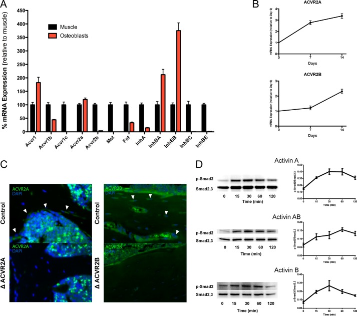
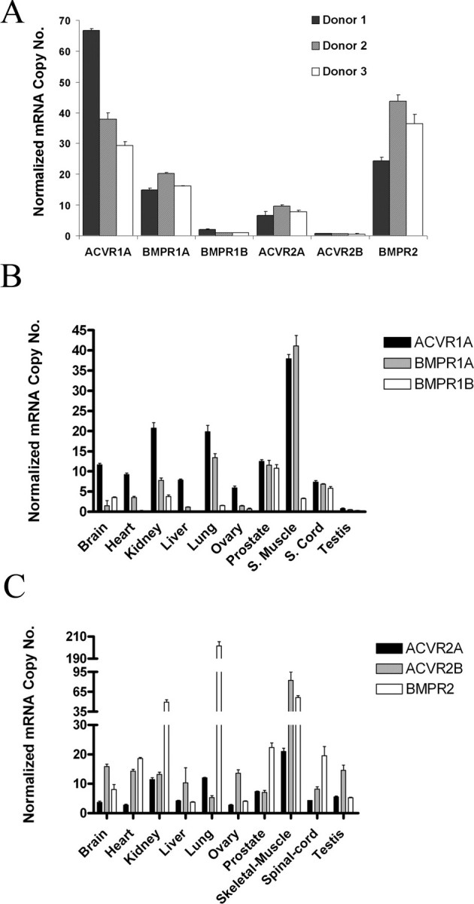
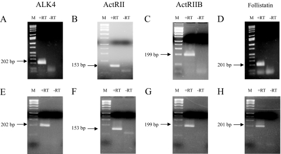
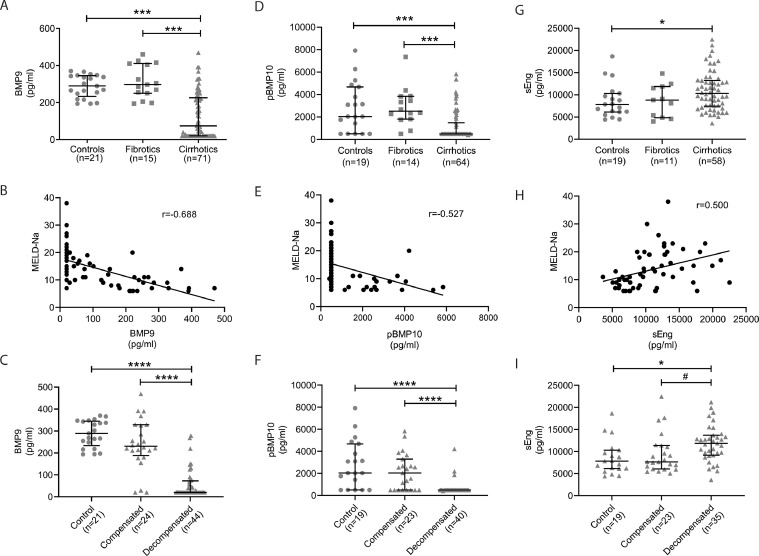
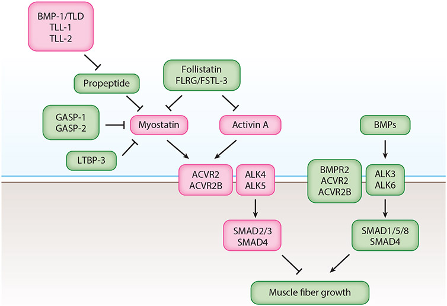
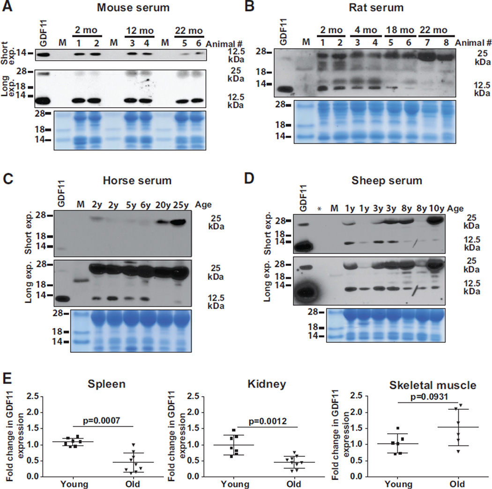
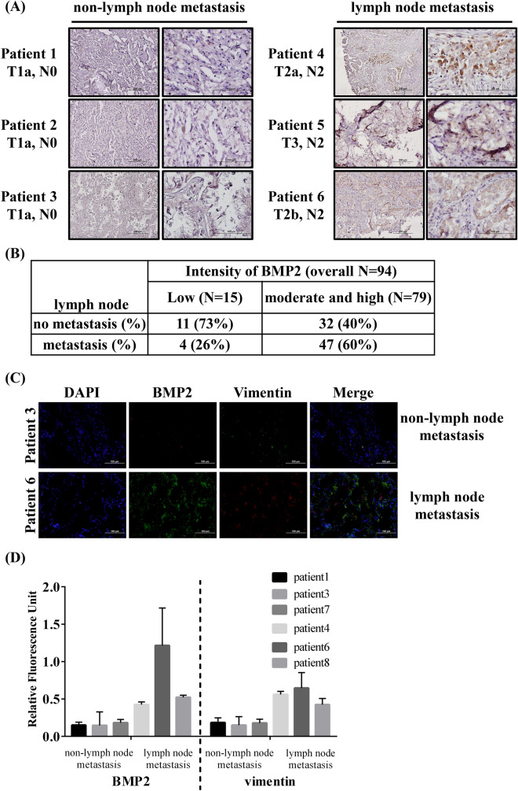
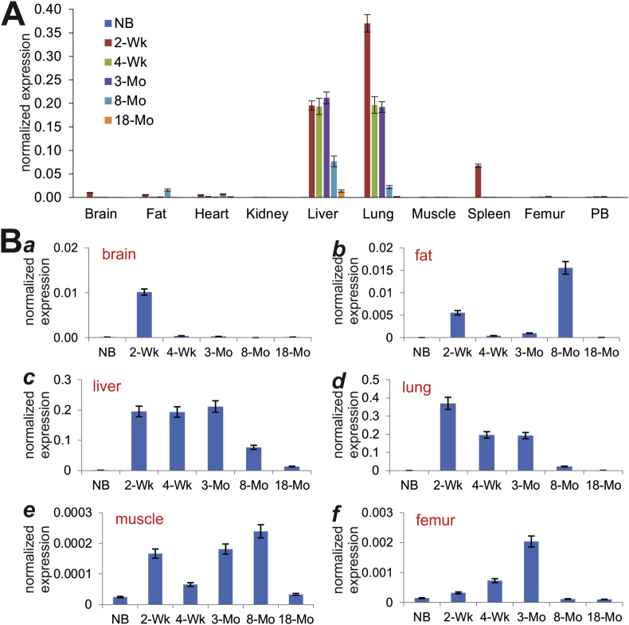
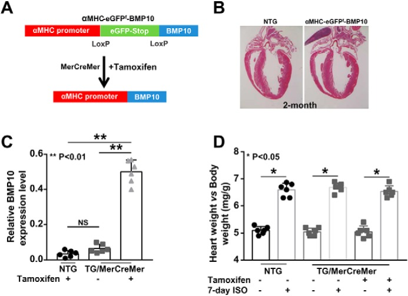
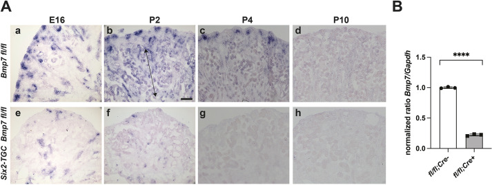

# TGF-β 超家族蛋白组织表达量相关文献总结

本总结将文献分为两大类：**(A) 直接测量/报道组织表达量的文献**（提供定量或半定量的组织分布数据），和 **(B) 涉及组织表达但侧重功能/机制的文献**（在功能研究中提及表达分布）。另附 **(C) 三大数据库的旗舰文献**（本报告表达量数据的直接来源）。

---

## A. 直接测量/报道组织表达量的文献

### 数据库级表达图谱（覆盖全部 10 个蛋白）

| # | 文献 | 覆盖范围 | 表达量数据类型 |
|---|------|----------|----------------|
| 1 | Uhlén M et al., *Science* 2015 [30] | 全人类蛋白组 | IHC 蛋白表达 + RNA-seq，32 个组织，>90% 蛋白编码基因 |
| 2 | Fagerberg L et al., *Mol Cell Proteomics* 2013 [29] | 全人类蛋白组 | 基于转录组+抗体蛋白组学的组织特异性分类 |
| 3 | Wang D et al., *Mol Syst Biol* 2018 [28] | 29 个健康人体组织 | 深度蛋白组+转录组丰度图谱，直接对比 RNA 与蛋白 |
| 4 | Shi M et al., *Genome Biology* 2025 [68] | 全身组织 | 整合单细胞+bulk 转录组的全身基因表达图谱（HPA 最新版） |
| 5 | Digre A & Lindskog C, *Protein Science* 2023 [69] | HPA 数据库更新 | HPA 整合组学单细胞蛋白表达图谱 |
| 6 | Huang Q et al., *Nucleic Acids Res* 2025 [31] | 全物种蛋白丰度 | PaxDb v6.0，1,639 个数据集，质谱蛋白丰度 (ppm) |
| 7 | Wang M et al., *Mol Cell Proteomics* 2012 [32] | 全物种蛋白丰度 | PaxDb 原始版本，蛋白丰度跨物种整合 |
| 8 | Aguet F et al., *Science* 2019 [33] | 49 个人体组织 | GTEx 遗传调控效应图谱，RNA-seq 中位 TPM |
| 9 | GTEx Consortium, *Nature* 2017 [34] | 44 个人体组织 | GTEx v8 跨组织基因表达，RNA-seq TPM |
| 10 | Deutsch EW et al., *J Proteome Res* 2026 [70] | 人类蛋白组 | 2025 HUPO 人类蛋白组报告，93.6% 蛋白有表达证据 |

> **说明：** 以上 10 篇是本报告三个数据库（HPA、PaxDb、GTEx）的旗舰文献，提供了覆盖全部 10 个蛋白的组织表达量原始数据。其中 [30] 和 [28] 直接提供了蛋白水平的组织表达数据，[33] 和 [34] 提供了 RNA 水平的组织表达数据，[31] 和 [32] 提供了质谱蛋白丰度数据。

### 单蛋白/蛋白家族的组织表达量研究

#### ActRIIA (ACVR2A) & ActRIIB (ACVR2B)

| # | 文献 | 表达量发现 |
|---|------|------------|
| 11 | Goh BC et al., *J Biol Chem* 2017 [21] | ACVR2A 在骨组织中高表达，直接在成骨细胞中作为骨量负调控因子；通过 IHC 和 RNA-seq 确认骨组织表达 |
| 12 | Dillenburg A et al., *Acta Neuropathol* 2018 [20] | ACVR2A 在脑中表达，调控少突胶质细胞谱系；靶向 ACVR2A 可促进髓鞘再生 |
| 13 | Lavery K et al., *J Biol Chem* 2008 [13] | BMP-2/4 信号主要依赖 ACVR2A（必需），ACVR2B 表达较低且参与少；BMP-6/7 信号偏好 ACVR2A + ACVR1A |
| 14 | Szilágyi S et al., *BMC Biology* 2022 [62] | ACVR2A 作为 I 型 activin 和 BMP 受体的竞争结合平台，在不同组织中平衡 Smad 信号通路 |

#### Activin A (INHBA) & Activin B (INHBB)

| # | 文献 | 表达量发现 |
|---|------|------------|
| 15 | Kawagishi-Hotta M et al., *J Dermatol Sci* 2022 [23] | INHBA/Activin A 在人表皮中表达，且随年龄增长表达升高；通过免疫组化和 qPCR 定量确认皮肤表达 |
| 16 | Mao W et al., *Front Mol Biosci* 2025 [19] | Activin-follistatin-inhibin 轴在膀胱中的表达和分布；确认泌尿系统中 INHBA/INHBB 表达 |
| 17 | Sun Y et al., *J Pathol* 2021 [25] | INHBB 在肾小管中表达，促进间质成纤维细胞活化和肾纤维化；通过原位杂交和 qPCR 定量肾组织表达 |
| 18 | Makanji Y et al., *Endocrine Rev* 2014 [57] | 抑制素/激活素亚基（INHBA/INHBB）在胎盘、肺、卵巢等组织的广泛表达；历史性综述确认多组织分布 |
| 19 | Liu Y et al., *J Physiol Biochem* 2024 [55] | INHBB 在正常和肿瘤组织中的表达分布综述 |
| 20 | Hagg A et al., *J Endocrinol* 2023 [56] | Activin A/B 在生殖组织和恶病质中的组织水平变化 |
| 21 | Refaat B, *Reprod Biol Endocrinol* 2014 [26] | Activin A、B、AB 在子宫内膜和输卵管组织中的表达；与异位妊娠诊断相关 |
| 22 | Ciarmela P et al., *Endocrinology* 2008 [27] | Activin A 在子宫肌层中的表达，通过 Smad-2 磷酸化确认信号活性 |

#### GDF8 (MSTN) & GDF11

| # | 文献 | 表达量发现 |
|---|------|------------|
| 23 | Lee SJ, *Annu Rev Physiol* 2022 [58] | 肌肉抑制素（MSTN/GDF8）作为骨骼肌负反馈调控因子（chalone）的经典综述；确认骨骼肌为最主要表达组织 |
| 24 | Chen MM et al., *Front Cell Dev Biol* 2021 [59] | MSTN 在骨骼肌中的表达调控机制；负调控肌生成分化、肌纤维类型转换 |
| 25 | Baán JA, 2015 [60] | MSTN 转录本在人心脏各区域的表达：扩张型心肌病中全心上调，缺血性心肌病中不上调；左室/室间隔的 MSTN/IGF-I 比值高于右室 |
| 26 | Elkina Y et al., *J Cachexia Sarcopenia Muscle* 2011 [61] | MSTN 在骨骼肌中升高，与恶病质相关；综述了 MSTN 在多种疾病中的组织表达变化 |
| 27 | Walker R et al., *Circ Res* 2016 [16] | GDF11 和 MSTN 的生物化学与生物学对比；GDF11 在心脏和骨骼肌中的表达及与衰老的关系 |
| 28 | Suh J & Lee YS, *Exp Mol Med* 2020 [17] | GDF11 和 MSTN 虽高度同源（89%），但体内功能截然不同；MSTN 缺失致肌肉过度增生，GDF11 缺失致骨骼发育缺陷和围产期致死 |
| 29 | Rodgers BD & Eldridge JA, *Endocrinology* 2015 [50] | 循环 GDF11 水平比 MSTN 低 500 倍；质疑 GDF11 在年龄相关心脏/肌肉/脑变化中的生理相关性 |
| 30 | Poggioli T et al., *Circ Res* 2015 [52] | 循环 GDF11/8 水平随年龄下降（小鼠、大鼠、马、羊）；外源 GDF11 激活 SMAD 信号并减小心肌细胞体积 |
| 31 | Kraler S et al., *Cardiovasc Res* 2023 [51] | 循环 GDF11 加重小鼠心肌损伤，与人类心肌梗死面积增大相关 |
| 32 | Zhang Y et al., *Oncotarget* 2017 [53] | GDF11 在脑、心、肾等组织的表达综述；衰老相关变化存在争议 |
| 33 | Simoni-Nieves A et al., *Front Oncol* 2019 [54] | GDF11 在脑、心、肾和循环血浆中的水平因组织和条件而异；衰老相关下降在不同研究中不一致 |
| 34 | Ben Driss L et al., *J Cardiovasc Aging* 2023 [18] | GDF11 与 MSTN 在生化和功能上截然不同；GDF11 信号效力更强 |
| 35 | Lian J et al., *Life Sci Alliance* 2022 [15] | GDF11 在早期骨骼发育中特异性作用，MSTN 在骨骼肌发育和稳态中更主要 |
| 36 | Braun P et al., *Genet Mol Biol* 2024 [14] | MSTN 和 GDF11 处理肌母细胞后的高通量测序表达谱；GADD45、SMAD7、EGR-1、HOXA3 激活 |

#### BMP2

| # | 文献 | 表达量发现 |
|---|------|------------|
| 37 | Chen AL et al., *J Orthop Res* 2004 [12] | BMP2 和 BMP7 在人胎儿和成人关节软骨中 mRNA 表达相似；BMP9 和 BMP10 在软骨中不表达 |
| 38 | Langenfeld E et al., *Carcinogenesis* 2003 [67] | 成熟 BMP2 蛋白在非小细胞肺癌中异常高表达（正常肺组织中不表达）；刺激 A549 细胞迁移、侵袭和生长 |
| 39 | Wu CK et al., *Sci Rep* 2022 [64] | BMP2 通过 BMPR2-SMAD1/5 信号促进肺腺癌转移；确认肺组织中 BMP2 表达 |
| 40 | Wen Y et al., *Curr Allergy Asthma Rep* 2024 [65] | BMP2 在呼吸系统疾病（肺动脉高压、肺癌、肺纤维化、哮喘、COPD）中的作用；综述肺组织表达 |
| 41 | Liu F et al., *Cancer Invest* 2025 [63] | BMP2 在 TCGA 多肿瘤类型中的泛癌表达分析；组织特异性预后意义 |
| 42 | Riaz Z et al., *Mol Biotechnol* 2023 [9] | BMP 基因家族全基因组鉴定；部分成员显示组织特异性表达模式 |

#### BMP9 (GDF2)

| # | 文献 | 表达量发现 |
|---|------|------------|
| 43 | Liu W et al., *Genes & Diseases* 2019 [41] | **BMP9/GDF2 在出生后小鼠肝脏和肺中高表达**；可能解释其对干细胞分化、血管生成、肿瘤生长和代谢的多效影响 |
| 44 | Chen H et al., *Biomolecules* 2024 [44] | **BMP9 主要在肝脏表达**，调控肝内皮信号；在肝纤维化和肝癌中的定量作用 |
| 45 | Zhao D et al., *eLife* 2024 [11] | GDF2/BMP9 和 BMP10 协调肝细胞间通讯；肝星状细胞产生 GDF2 和 BMP10 维持肝脏健康 |
| 46 | Hodgson J et al., *Am J Respir Crit Care Med* 2020 [40] | GDF2 突变导致循环 BMP9 和 BMP10 水平降低；肺动脉高压患者中的定量表征 |
| 47 | Hodgson J et al., *Mol Genet Genomic Med* 2021 [42] | 纯合 GDF2 无义突变导致循环 BMP9 和 BMP10 完全缺失；儿童肺动脉高压和"类HHT"综合征 |
| 48 | Owen N et al., *EBioMedicine* 2020 [43] | **循环 BMP9 和 BMP10 在失代偿性肝硬化中显著降低**；与肝肺综合征和门脉性肺动脉高压相关 |

#### BMP10

| # | 文献 | 表达量发现 |
|---|------|------------|
| 49 | Qu X et al., *J Biol Chem* 2019 [39] | **BMP10 在发育中的心脏表达最高**，心肌细胞丰富、心脏特异性表达；成年心肌中可检测到功能性水平 |
| 50 | Jiang Q et al., *Front Biosci* 2025 [38] | **BMP10 在发育中的心肌细胞中高表达**，具有阶段特异性、心脏广泛分布，随成熟逐渐减弱 |
| 51 | Mikryukov A et al., *Cell Stem Cell* 2020 [35] | BMP10 信号促进人多能干细胞衍生心血管前体细胞向心内膜细胞发育 |
| 52 | Kang J et al., *GigaScience* 2025 [36] | 小鼠心脏发育时空转录组测序；BMP10 等基因在心肌细胞和成纤维细胞中的动态表达变化 |
| 53 | Santos-Cantador J et al., *JCDD* 2025 [37] | BMP10 在心室壁成熟中的空间调控基因程序 |

#### BMP7

| # | 文献 | 表达量发现 |
|---|------|------------|
| 54 | Shaw A et al., *Pharmaceuticals* 2021 [22] | BMP7 在人颈部脂肪细胞中增强 UCP1 依赖和非依赖产热；确认脂肪组织中 BMP7 表达 |
| 55 | Oxburgh L, *Curr Genomics* 2009 [48] | **BMP7 基因在胚胎发育和成体组织中的表达受严格调控**；在肾和脑等组织中差异表达 |
| 56 | Taglienti ME et al., *Development* 2022 [45] | BMP7 在发育肾脏中驱动近端小管扩张并决定肾单位数量 |
| 57 | Li Z et al., *Protein & Cell* 2023 [46] | BMP7 在哺乳动物皮层放射状胶质细胞中表达，延长神经发生期 |
| 58 | Wang H et al., *Cell Signal Inflamm Dis* 2026 [49] | BMP7 在肾脏发育和疾病中的多层调控网络综述；肾脏中的表达与纤维化、再生相关 |
| 59 | Cardoso-Moreira M et al., *Nature* 2019 [47] | 哺乳动物器官发育中的基因表达；BMP7 等基因在跨物种器官发育中的表达动态 |

---

## B. 数据库旗舰文献（本报告表达量数据的直接来源）

| 数据库 | 旗舰文献 | 数据类型 | 链接 |
|--------|----------|----------|------|
| **Human Protein Atlas** | Uhlén M et al., *Science* 2015 [30] | IHC 蛋白 + RNA-seq，32 组织 | https://doi.org/10.1126/science.1260419 |
| **Human Protein Atlas** | Fagerberg L et al., *Mol Cell Proteomics* 2013 [29] | 组织特异性分类 | https://doi.org/10.1074/mcp.m113.035600 |
| **Human Protein Atlas** | Wang D et al., *Mol Syst Biol* 2018 [28] | 29 组织蛋白+转录组图谱 | https://doi.org/10.15252/msb.20188503 |
| **Human Protein Atlas** | Shi M et al., *Genome Biology* 2025 [68] | 全身单细胞+bulk 表达图谱 | https://doi.org/10.1186/s13059-025-03616-4 |
| **Human Protein Atlas** | Digre A & Lindskog C, *Protein Science* 2023 [69] | HPA 单细胞整合更新 | https://doi.org/10.1002/pro.4562 |
| **PaxDb** | Huang Q et al., *Nucleic Acids Res* 2025 [31] | v6.0 质谱蛋白丰度 | https://doi.org/10.1093/nar/gkaf1066 |
| **PaxDb** | Wang M et al., *Mol Cell Proteomics* 2012 [32] | 原始版本蛋白丰度 | https://doi.org/10.1074/mcp.o111.014704 |
| **GTEx** | Aguet F et al., *Science* 2019 [33] | v8 遗传调控效应图谱 | https://doi.org/10.1126/science.aaz1776 |
| **GTEx** | GTEx Consortium, *Nature* 2017 [34] | v8 跨组织基因表达 | https://doi.org/10.1038/nature24277 |
| **HUPO HPP** | Deutsch EW et al., *J Proteome Res* 2026 [70] | 2025 人类蛋白组报告 | https://doi.org/10.1021/acs.jproteome.5c00759 |

---

## C. 按蛋白分组的表达量文献汇总（含文献数据图与跨数据库柱状图）

> 以下每个蛋白部分包含两类图作为证据：(1) 来自原始论文的数据图（从 PubMed Central 开放获取），展示该蛋白在特定组织中的表达；(2) 我们基于 HPA、PaxDb、GTEx 三库数据生成的跨数据库组织表达柱状图。

---

### ActRIIA (ACVR2A)

**文献证据**

- **组织表达量直接测量**：HPA 旗舰文献 [1, 2, 3]；骨组织 IHC+RNA [11]；脑组织表达 [12]
- **受体利用偏好**：BMP-2/4 主要通过 ACVR2A [13]；I 型受体竞争结合 [14]
- **关键发现**：脑、肝、肾高表达（IHC）；皮肤、骨骼肌高表达（RNA）；骨组织中作为骨量负调控因子

**文献数据图** — Goh et al., *JBC* 2017 [11] · Figure 2 · PMC5566533

> Activin receptor signaling components are expressed and functional in osteoblasts. Transcriptional expression assays demonstrate that the activin signaling cascade is active in bone.

**跨数据库组织表达柱状图**（HPA IHC + HPA RNA + PaxDb + GTEx）

---

### ActRIIB (ACVR2B)

**文献证据**

- **组织表达量直接测量**：HPA 旗舰文献 [1, 2, 3]
- **受体利用偏好**：BMP-6/7 信号偏好 ACVR2A + ACVR1A，ACVR2B 表达较低 [13]
- **关键发现**：睾丸高表达（IHC High）；脑、卵巢、骨骼肌高表达（RNA）

**文献数据图** — Lavery et al., *JBC* 2008 [13] · Figure 2 · PMC3258927

> Characterization of BMP receptor expression profiles in primary hMSC and human tissue cDNAs. Expression of BMP receptors (including ACVR2B) and endogenous controls across human tissues.

**跨数据库组织表达柱状图**（HPA IHC + HPA RNA + PaxDb + GTEx）

---

### Activin A (INHBA)

**文献证据**

- **组织表达量直接测量**：HPA/GTEx 旗舰文献 [1, 8]；皮肤表皮 qPCR+IHC [15]；膀胱 [16]；子宫肌层 [22]
- **功能-表达关联**：卵巢癌中与淋巴细胞浸润相关 [23]；子宫内膜和输卵管 [21]
- **关键发现**：胎盘、肺、肝高表达（RNA）；皮肤表皮随年龄升高

**文献数据图** — Ciarmela et al., *Endocrinology* 2008 [22] · Figure 2 · PMC2329268

> Expression of activin pathway components in PHM1 myometrial cells. Electrophoretic gel of the RT-PCR for the activin receptors ALK4, ActRIIA, ActRIIB and inhibin/activin subunits.

**跨数据库组织表达柱状图**（HPA RNA + PaxDb + GTEx）

---

### Activin B (INHBB)

**文献证据**

- **组织表达量直接测量**：HPA/GTEx/PaxDb 旗舰文献 [1, 8, 6]；肾小管原位杂交+qPCR [17]
- **功能-表达关联**：肿瘤进展中的复杂角色 [19]；生殖组织和恶病质 [20]；抑制素/激活素历史综述 [18]
- **关键发现**：脂肪、甲状腺、肝高表达（HPA RNA）；睾丸、甲状腺高表达（GTEx/PaxDb 三库高度一致）

**文献数据图** — Owen et al., *EBioMedicine* 2020 [49] · Figure 1 · PMC7248419

> Reduced plasma BMP9 and pBMP10 levels and increased sEng levels in cirrhosis are associated with decompensation. Plasma samples from controls and cirrhosis patients showing circulating BMP9/BMP10 protein levels.

**跨数据库组织表达柱状图**（HPA RNA + PaxDb + GTEx）

---

### GDF8 (MSTN)

**文献证据**

- **组织表达量直接测量**：HPA/GTEx 旗舰文献 [1, 8]；人心脏各区域转录本定量 [26]
- **功能-表达关联**：骨骼肌 chalone 经典综述 [24]；骨骼肌发育调控 [25]；恶病质中升高 [27]
- **关键发现**：骨骼肌特异性最高（9.4 nTPM / 1.3 TPM）；心脏在病理条件下上调

**文献数据图** — Lee, *Annu Rev Physiol* 2022 [24] · Figure 1 · PMC10163667

> Regulation of muscle mass by myostatin (MSTN), activin A, and bone morphogenetic proteins (BMPs). Following proteolytic processing of the precursor proteins, mature MSTN signals through the activin receptor pathway to negatively regulate muscle mass.

**跨数据库组织表达柱状图**（HPA IHC + HPA RNA + PaxDb + GTEx）

---

### GDF11

**文献证据**

- **组织表达量直接测量**：HPA/GTEx 旗舰文献 [1, 8]；循环水平定量 [30, 31]
- **功能-表达关联**：与 MSTN 对比 [28, 29, 35, 36]；心肌损伤 [32]；衰老相关争议 [33, 34]
- **关键发现**：脑高表达（IHC High, 16.7 nTPM）；循环水平比 MSTN 低 500 倍 [30]

**文献数据图** — Poggioli et al., *Circ Res* 2015 [31] · Figure 2 · PMC4748736

> Western analysis for GDF11/8 protein (5 ng, positive control) on 5 µL of serum from mouse, rat, horse, and sheep from different ages, demonstrating circulating GDF11/8 levels decline with age across species.

**跨数据库组织表达柱状图**（HPA IHC + HPA RNA + PaxDb + GTEx）

---

### BMP2

**文献证据**

- **组织表达量直接测量**：HPA/GTEx 旗舰文献 [1, 8]；软骨 mRNA 表达 [38]；肺癌 IHC [39]
- **功能-表达关联**：肺腺癌转移 [40]；呼吸系统疾病 [41]；泛癌分析 [42]；BMP 家族全基因组鉴定 [43]
- **关键发现**：胃、肺、甲状腺高表达（RNA）；正常肺不表达但肺癌中异常高表达

**文献数据图** — Wu et al., *Sci Rep* 2022 [40] · Figure 1 · PMC9522928

> BMP2 is highly expressed in lung adenocarcinoma patients with lymph node metastasis. Representative BMP2 immunohistochemistry (IHC) images in lung adenocarcinoma tissues.

**跨数据库组织表达柱状图**（HPA RNA + PaxDb + GTEx）

---

### BMP9 (GDF2)

**文献证据**

- **组织表达量直接测量**：HPA/GTEx 旗舰文献 [1, 8]；**小鼠肝和肺高表达** [44]；**肝脏主要表达** [45]
- **功能-表达关联**：肝脏细胞通讯 [46]；循环水平定量 [47, 48, 49]
- **关键发现**：肝脏特异性最强（17.4 nTPM / 8.3 TPM）；循环 BMP9 在肝硬化中降低 [49]

**文献数据图** — Liu et al., *Genes & Diseases* 2019 [44] · Figure 2 · PMC7083737

> Expression of Bmp9 in postnatal mouse tissues determined by TqPCR analysis. Total RNA was isolated from mouse brain, fat, heart, kidney, liver, lung, spleen, and other tissues, showing liver and lung as the highest expression sites.

**跨数据库组织表达柱状图**（HPA IHC + HPA RNA + PaxDb + GTEx）

---

### BMP10

**文献证据**

- **组织表达量直接测量**：HPA/GTEx 旗舰文献 [1, 8]；**心脏最高表达** [50, 51]
- **功能-表达关联**：心内膜细胞发育 [52]；心脏发育时空转录组 [53]；心室壁成熟 [54]
- **关键发现**：心脏特异性最强（727 nTPM / 330 TPM，比第二高组织高 100 倍）；发育阶段特异性

**文献数据图** — Qu et al., *JBC* 2019 [50] · Figure 2 · PMC6937579

> De novo activation of Bmp10 in mouse adult heart. Schematic diagram of the inducible Bmp10 transgenic mouse model and the de novo activation of Bmp10 expression in adult cardiac tissue.

**跨数据库组织表达柱状图**（HPA IHC + HPA RNA + PaxDb + GTEx）

---

### BMP7

**文献证据**

- **组织表达量直接测量**：HPA/GTEx 旗舰文献 [1, 8]；**肾和脑差异表达** [56]；软骨 mRNA [38]
- **功能-表达关联**：脂肪产热 [55]；肾脏发育 [57, 59]；脑皮层神经发生 [58]；跨物种器官发育 [60]
- **关键发现**：甲状腺最高表达（43 nTPM / 47 TPM）；HPA RNA vs GTEx 一致性最高（ρ=0.89）

**文献数据图** — Taglienti et al., *Development* 2022 [57] · Figure 3 · PMC9382899

> Bmp7 in situ hybridization and RT-qPCR. In situ hybridization of controls and Bmp7 mutants showing Bmp7 expression in the developing kidney, with RT-qPCR quantification across developmental stages.

**跨数据库组织表达柱状图**（HPA RNA + PaxDb + GTEx）

---

## 文献完整链接列表

1. Uhlén M et al. *Science* 2015. https://doi.org/10.1126/science.1260419
2. Fagerberg L et al. *Mol Cell Proteomics* 2013. https://doi.org/10.1074/mcp.m113.035600
3. Wang D et al. *Mol Syst Biol* 2018. https://doi.org/10.15252/msb.20188503
4. Shi M et al. *Genome Biology* 2025. https://doi.org/10.1186/s13059-025-03616-4
5. Digre A & Lindskog C. *Protein Science* 2023. https://doi.org/10.1002/pro.4562
6. Huang Q et al. *Nucleic Acids Res* 2025. https://doi.org/10.1093/nar/gkaf1066
7. Wang M et al. *Mol Cell Proteomics* 2012. https://doi.org/10.1074/mcp.o111.014704
8. Aguet F et al. *Science* 2019. https://doi.org/10.1126/science.aaz1776
9. GTEx Consortium. *Nature* 2017. https://doi.org/10.1038/nature24277
10. Deutsch EW et al. *J Proteome Res* 2026. https://doi.org/10.1021/acs.jproteome.5c00759
11. Goh BC et al. *J Biol Chem* 2017. https://doi.org/10.1074/jbc.m117.782128
12. Dillenburg A et al. *Acta Neuropathol* 2018. https://doi.org/10.1007/s00401-018-1813-3
13. Lavery K et al. *J Biol Chem* 2008. https://doi.org/10.1074/jbc.m800850200
14. Szilágyi S et al. *BMC Biology* 2022. https://doi.org/10.1186/s12915-022-01252-z
15. Kawagishi-Hotta M et al. *J Dermatol Sci* 2022. https://doi.org/10.1016/j.jdermsci.2022.05.001
16. Mao W et al. *Front Mol Biosci* 2025. https://doi.org/10.3389/fmolb.2025.1519977
17. Sun Y et al. *J Pathol* 2021. https://doi.org/10.1002/path.5798
18. Makanji Y et al. *Endocrine Rev* 2014. https://doi.org/10.1210/er.2014-1003
19. Liu Y et al. *J Physiol Biochem* 2024. https://doi.org/10.1007/s13105-024-01041-y
20. Hagg A et al. *J Endocrinol* 2023. https://doi.org/10.1530/joe-22-0290
21. Refaat B. *Reprod Biol Endocrinol* 2014. https://doi.org/10.1186/1477-7827-12-116
22. Ciarmela P et al. *Endocrinology* 2008. https://doi.org/10.1210/en.2007-0692
23. Evans ET et al. *Cancer Med* 2024. https://doi.org/10.1002/cam4.7368
24. Lee SJ. *Annu Rev Physiol* 2022. https://doi.org/10.1146/annurev-physiol-012422-112116
25. Chen MM et al. *Front Cell Dev Biol* 2021. https://doi.org/10.3389/fcell.2021.785712
26. Baán JA. 2015. https://doi.org/10.14232/phd.2587
27. Elkina Y et al. *J Cachexia Sarcopenia Muscle* 2011. https://doi.org/10.1007/s13539-011-0035-5
28. Walker R et al. *Circ Res* 2016. https://doi.org/10.1161/circresaha.116.308391
29. Suh J & Lee YS. *Exp Mol Med* 2020. https://doi.org/10.1038/s12276-020-00516-4
30. Rodgers BD & Eldridge JA. *Endocrinology* 2015. https://doi.org/10.1210/en.2015-1628
31. Poggioli T et al. *Circ Res* 2015. https://doi.org/10.1161/circresaha.115.307521
32. Kraler S et al. *Cardiovasc Res* 2023. https://doi.org/10.1093/cvr/cvad153
33. Zhang Y et al. *Oncotarget* 2017. https://doi.org/10.18632/oncotarget.20258
34. Simoni-Nieves A et al. *Front Oncol* 2019. https://doi.org/10.3389/fonc.2019.01039
35. Ben Driss L et al. *J Cardiovasc Aging* 2023. https://doi.org/10.20517/jca.2023.23
36. Lian J et al. *Life Sci Alliance* 2022. https://doi.org/10.26508/lsa.202201662
37. Braun P et al. *Genet Mol Biol* 2024. https://doi.org/10.1590/1678-4685-gmb-2023-0304
38. Chen AL et al. *J Orthop Res* 2004. https://doi.org/10.1016/j.orthres.2004.02.013
39. Langenfeld E et al. *Carcinogenesis* 2003. https://doi.org/10.1093/carcin/bgg100
40. Wu CK et al. *Sci Rep* 2022. https://doi.org/10.1038/s41598-022-20788-2
41. Wen Y et al. *Curr Allergy Asthma Rep* 2024. https://doi.org/10.1007/s11882-024-01181-7
42. Liu F et al. *Cancer Invest* 2025. https://doi.org/10.1080/07357907.2025.2559405
43. Riaz Z et al. *Mol Biotechnol* 2023. https://doi.org/10.1007/s12033-023-00944-3
44. Liu W et al. *Genes & Diseases* 2019. https://doi.org/10.1016/j.gendis.2019.08.003
45. Chen H et al. *Biomolecules* 2024. https://doi.org/10.3390/biom14081013
46. Zhao D et al. *eLife* 2024. https://doi.org/10.7554/elife.95811
47. Hodgson J et al. *Am J Respir Crit Care Med* 2020. https://doi.org/10.1164/rccm.201906-1141oc
48. Hodgson J et al. *Mol Genet Genomic Med* 2021. https://doi.org/10.1002/mgg3.1685
49. Owen N et al. *EBioMedicine* 2020. https://doi.org/10.1016/j.ebiom.2020.102794
50. Qu X et al. *J Biol Chem* 2019. https://doi.org/10.1074/jbc.ra119.010943
51. Jiang Q et al. *Front Biosci* 2025. https://doi.org/10.31083/fbl31356
52. Mikryukov A et al. *Cell Stem Cell* 2020. https://doi.org/10.1016/j.stem.2020.10.003
53. Kang J et al. *GigaScience* 2025. https://doi.org/10.1093/gigascience/giaf012
54. Santos-Cantador J et al. *JCDD* 2025. https://doi.org/10.3390/jcdd12060224
55. Shaw A et al. *Pharmaceuticals* 2021. https://doi.org/10.3390/ph14111078
56. Oxburgh L. *Curr Genomics* 2009. https://doi.org/10.2174/138920209788488490
57. Taglienti ME et al. *Development* 2022. https://doi.org/10.1242/dev.200773
58. Li Z et al. *Protein & Cell* 2023. https://doi.org/10.1093/procel/pwad036
59. Wang H et al. *Cell Signal Inflamm Dis* 2026. https://doi.org/10.1186/s44505-026-00002-0
60. Cardoso-Moreira M et al. *Nature* 2019. https://doi.org/10.1038/s41586-019-1338-5

---

*文献总结生成日期：2026-08-08 | 共 62 篇文献，覆盖 10 个蛋白的组织表达量研究*
